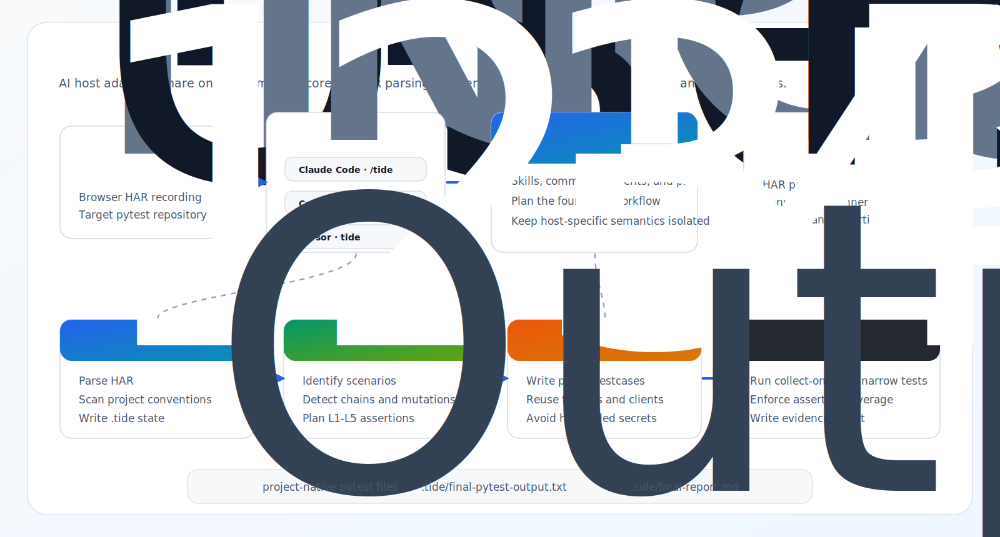

<div align="center">

# Tide

**HAR-driven, source-aware API test generation for pytest suites.**

Turn browser HAR recordings into project-native pytest API tests with convention scanning, L1-L5 assertion planning, and deterministic quality gates.

<p>
  <a href="./README.md">中文</a> | English
</p>

<p>
  <a href="./pyproject.toml"></a>
  <a href="./pyproject.toml"></a>
  <a href="https://docs.astral.sh/uv/"></a>
  <a href="https://pytest.org/"></a>
  <a href="./LICENSE"></a>
</p>

<p>
  
  
  
</p>

```text
/using-tide
/tide ./recordings/api.har
```

</div>

---

## Overview

Tide is an AI-plugin workflow plus a deterministic Python execution layer for API automation projects.

It is built for the case where a team already has a pytest-based interface testing project and wants generated tests to follow that repository's real conventions: API clients, fixtures, naming, auth helpers, assertions, and output paths.



## Why Tide

| Capability | What it gives you |
|---|---|
| HAR to pytest | Converts a recorded browser flow into collectable pytest interface tests. |
| Source-aware generation | Uses backend source or API definitions when available to strengthen assertions. |
| Existing-project fit | Scans local test structure, fixtures, API clients, naming style, and assertion helpers. |
| L1-L5 assertions | Plans assertions from transport checks through state and end-to-end business effects. |
| Deterministic gates | Validates HAR parsing, scenarios, generated assertions, write scope, and pytest output. |
| Multi-host support | Ships native Claude Code, Codex, and Cursor entrypoints over the same core assets. |

> [!IMPORTANT]
> Tide should write generated tests and `.tide/` state. It should not rewrite business code, shared config, or secrets unless the user explicitly approves that scope.

## Supported Hosts

| Host | User entry | Tide assets |
|---|---|---|
| Claude Code | `/using-tide`, `/tide <har-file>` | `.claude-plugin/`, `skills/`, `agents/`, `prompts/`, `scripts/` |
| Codex | `$using-tide`, `$tide <har-file>` | `.codex-plugin/`, `codex-skills/`, `commands/`, `.agents/plugins/` |
| Cursor | `using-tide`, `tide <har-file>` | `.cursor/rules/`, `.cursor/commands/` |

Host-specific files adapt command syntax and tool semantics. The deterministic scripts under `scripts/` are shared.

## Quick Start

### Requirements

- Python `3.12+`
- `uv`
- A pytest API automation project
- A browser-exported `.har` file

### Claude Code

```bash
claude plugins marketplace add koco-co/tide
claude plugins install tide
```

Then open the target automation project and run:

```text
/using-tide
/tide ./recordings/api.har
```

For local plugin development:

```bash
git clone https://github.com/koco-co/tide.git ~/.claude/plugins/tide
cd ~/.claude/plugins/tide
uv sync
```

If your Claude Code environment requires a namespaced command:

```text
/tide:tide ./recordings/api.har --yes --non-interactive
```

### Codex

Tide includes Codex-native plugin metadata and skills:

```text
.codex-plugin/plugin.json
codex-skills/tide/SKILL.md
codex-skills/using-tide/SKILL.md
commands/tide.md
commands/using-tide.md
```

Install or reload the local Tide plugin in Codex, then use the skills from the target project:

```text
$using-tide
$tide ./recordings/api.har
```

The Codex adapter resolves the installed plugin root as `TIDE_PLUGIN_DIR` and runs Tide scripts from the plugin environment. The target project's Python is reserved for executing generated pytest tests.

### Cursor

Tide includes Cursor rules and command docs:

```text
.cursor/rules/tide-core.mdc
.cursor/rules/tide-init.mdc
.cursor/commands/tide.md
.cursor/commands/using-tide.md
```

Open the target project in Cursor with the Tide rules available, then run:

```text
using-tide
tide ./recordings/api.har
```

## Workflow

Tide uses four waves. AI handles project understanding and test design; scripts handle parsing, normalization, and validation.

| Wave | Purpose | Typical artifacts |
|---|---|---|
| 1. Prepare | Parse HAR and scan project conventions. | `.tide/parsed.json`, `.tide/project-assets.json`, `.tide/convention-fingerprint.yaml` |
| 2. Understand | Identify scenarios, request chains, risks, and assertion opportunities. | `.tide/scenarios.json`, `.tide/generation-plan.json` |
| 3. Generate | Write pytest files using local helpers and style. | Generated tests under `testcases/` or the configured output path |
| 4. Verify | Run narrow validation and produce a final evidence report. | `.tide/final-pytest-output.txt`, `.tide/final-report.md` |

Typical run:

```bash
# Open the target pytest automation project in your AI host.
/using-tide
/tide ./recordings/metadata-sync.har

# Verify generated tests.
python -m pytest --collect-only testcases -q
python -m pytest testcases -q
```

## Assertion Model

| Layer | Meaning | Examples |
|---|---|---|
| L1 | Transport success | HTTP status, response presence, request completed |
| L2 | API contract | `code == 0`, required keys, stable field types |
| L3 | Business response | Created name, sync status, list contains expected item |
| L4 | State mutation | Follow-up read verifies create/update/delete effect |
| L5 | End-to-end chain | Multi-step flow reaches the final observable business state |

> [!NOTE]
> Write scenarios should include L4. Chained user flows should include L5. Tide's generated assertion gate must mark missing required layers as a failed run, even if formatting and pytest collection pass.

## Quality Gates

| Gate | Requirement |
|---|---|
| Collectability | Generated tests pass `pytest --collect-only`. |
| Project fit | Imports, fixtures, API clients, class granularity, and naming follow local anchors. |
| Assertion coverage | Each interface has L1-L3; write scenarios include L4; chain scenarios include L5. |
| Data safety | No hardcoded active base URL, token, webhook secret, credential, or unstable runtime ID. |
| Scenario integrity | `scenario_id` values are unique and confidence is backed by evidence. |
| Write scope | Generated output stays inside approved test and `.tide/` paths. |

For strict runs, Tide records the real final pytest output:

```text
.tide/final-pytest-output.txt
```

Without that file, a run must not be summarized as successful.

## Configuration

Tide stores target-project state and configuration under `.tide/`.

```text
.tide/tide-config.yaml
.tide/repo-profiles.yaml
```

Minimal `tide-config.yaml`:

```yaml
project:
  type: existing_automation
  language: python
  test_framework: pytest

paths:
  tests: testcases
  api_clients: api
  config: config
  utilities: utils

generation:
  assertion_policy: l1_l5
  prefer_existing_helpers: true
  no_source_mode: false

safety:
  forbid_hardcoded_base_url: true
  forbid_plaintext_secrets: true
  write_scope:
    - testcases
    - .tide
```

Minimal `repo-profiles.yaml`:

```yaml
repositories:
  backend:
    path: ../backend
    role: source_trace
    optional: true

  automation:
    path: .
    role: pytest_target
    optional: false
```

Secrets belong in environment variables or local `.env` files excluded from version control. Generated tests should reference configured auth and environment helpers instead of captured HAR tokens.

## Modes

| Mode | Use when | Behavior |
|---|---|---|
| Source-aware | Backend source or API definitions are available. | Trace endpoints, infer state transitions, and strengthen L4/L5 assertions. |
| No-source | Only HAR evidence and the target automation project are available. | Use observed responses, request chains, naming heuristics, and honest confidence labels. |

No-source mode should still generate useful tests. It should not pretend to know backend internals that were not observed.

## Deterministic Core

| Script | Role |
|---|---|
| `scripts.har_parser` | Parse and normalize HAR recordings. |
| `scripts.convention_scanner` | Extract pytest project conventions and reusable assets. |
| `scripts.scenario_validator` | Validate scenario structure and evidence. |
| `scripts.scenario_normalizer` | Repair and normalize scenario and generation-plan files. |
| `scripts.deterministic_case_writer` | Produce fallback pytest files when model generation stalls. |
| `scripts.generated_assertion_gate` | Enforce required assertion layers in generated tests. |
| `scripts.write_scope_guard` | Keep writes inside approved paths. |

Run scripts from the Tide plugin environment:

```bash
cd /path/to/tide
PYTHONPATH="$PWD:$PYTHONPATH" uv run python3 -m scripts.har_parser --help
```

## Repository Layout

```text
tide/
├── .claude-plugin/       # Claude Code plugin metadata
├── .codex-plugin/        # Codex plugin metadata
├── .cursor/              # Cursor rules and commands
├── .agents/plugins/      # Local Codex plugin marketplace entry
├── agents/               # Host-facing agent prompts
├── assets/               # README and plugin visual assets
├── codex-skills/         # Codex skill definitions
├── commands/             # Codex slash-command docs
├── prompts/              # Prompt fragments and style rules
├── scripts/              # Deterministic Python execution layer
├── skills/               # Claude Code skill definitions
└── tests/                # Contract and script tests
```

## Development

```bash
uv sync --all-extras
uv run pytest tests/test_skill_contract.py tests/test_agent_contracts.py tests/test_codex_plugin_contract.py -q
uv run pytest
```

Validate plugin metadata:

```bash
python3 -m json.tool .claude-plugin/plugin.json
python3 -m json.tool .codex-plugin/plugin.json
python3 -m json.tool .agents/plugins/marketplace.json
```

## Roadmap

- Incremental generation for existing suites.
- Stronger no-source confidence scoring.
- CI templates for generated test validation.
- Optional explicit parallel agent orchestration.
- More reusable project profiles for common pytest API stacks.

## License

[MIT](./LICENSE)
