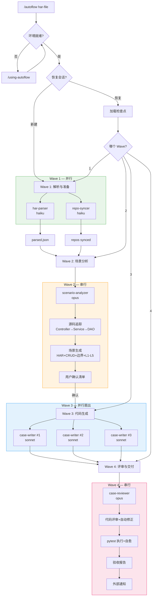
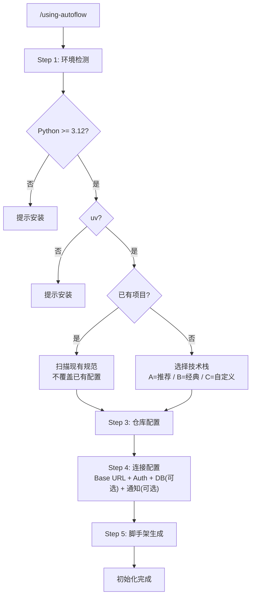

# sisyphus-autoflow

> HAR 驱动、源码感知的 API 接口自动化测试 — 由 Claude Code 驱动

[](LICENSE)
[](pyproject.toml)
[](PLUGIN.md)

---

## 特性

- **HAR → pytest**：丢入浏览器录制的 HAR 文件，自动获得生产级 pytest 测试套件，无需手写样板代码
- **源码感知**：读取后端源码（Controller → Service → DAO），深度理解业务逻辑，生成有意义的断言
- **L1-L5 断言层级**：覆盖从 HTTP 状态码验证（L1）到 AI 推断的隐式业务规则（L5）的完整断言体系
- **多 Agent 协同**：5 个专业 AI Agent 组成 4 波并行编排流水线，充分利用模型能力分工
- **交互式确认**：AI 提议测试场景清单，你确认后再生成代码 — 始终掌控生成结果

---

## 快速开始

```bash
# 1. 安装插件（任选一种方式，详见下方"安装"章节）
claude plugins marketplace add github:koco-co/sisyphus-autoflow
claude plugins install sisyphus-autoflow

# 2. 进入你的测试项目目录（新项目或已有项目均可）
cd /path/to/your-test-project

# 3. 初始化环境（首次使用）
#    在 Claude Code 中输入：
/using-autoflow

# 4. 丢入 HAR 文件，生成测试套件
/autoflow ./recordings/api.har
```

---

## 工作原理

sisyphus-autoflow 将 HAR 文件到测试套件的全过程分为 4 个执行波次，每波内部按依赖关系选择并行或串行调度：



---

## 断言层级

测试用例按照 5 层断言体系组织，层层递进，从协议合规到 AI 推断的隐式业务规则：

```mermaid
graph LR
    subgraph L1["L1 协议层"]
        L1a[HTTP 状态码]
        L1b[响应时间]
        L1c[Content-Type]
    end
    subgraph L2["L2 结构层"]
        L2a[Pydantic 模型]
        L2b[字段存在性]
        L2c[类型正确性]
    end
    subgraph L3["L3 数据层"]
        L3a[值范围]
        L3b[枚举合法性]
        L3c[格式校验]
    end
    subgraph L4["L4 业务层"]
        L4a[状态机]
        L4b[CRUD 一致性]
        L4c[数据库验证]
    end
    subgraph L5["L5 AI推断层"]
        L5a[隐式规则]
        L5b[安全边界]
        L5c[异常路径]
    end
    L1 --> L2 --> L3 --> L4 --> L5
    style L1 fill:#c8e6c9,stroke:#388e3c
    style L2 fill:#bbdefb,stroke:#1976d2
    style L3 fill:#fff9c4,stroke:#f9a825
    style L4 fill:#ffccbc,stroke:#e64a19
    style L5 fill:#e1bee7,stroke:#8e24aa
```



每层断言示例参见 [references/assertion-examples.md](references/assertion-examples.md)。

---

## 安装

### 前提条件

- [Claude Code](https://claude.ai/code) 已安装
- Python >= 3.12
- [uv](https://docs.astral.sh/uv/) 包管理器
- Git

### 方式一：Claude Code Plugin 安装（推荐）

```bash
# 步骤 1: 添加仓库为 marketplace
claude plugins marketplace add github:koco-co/sisyphus-autoflow

# 步骤 2: 从 marketplace 安装插件
claude plugins install sisyphus-autoflow

# 验证安装
claude plugins list
```

安装完成后，`/using-autoflow` 和 `/autoflow` 命令即可在 Claude Code 中使用。

**更新插件：**

```bash
claude plugins update sisyphus-autoflow
```

**卸载插件：**

```bash
claude plugins uninstall sisyphus-autoflow
```

### 方式二：从 GitHub 手动下载到项目中

适用于不想注册 marketplace，或需要自定义修改插件代码的场景。

**全局安装（所有项目可用）：**

```bash
# 克隆到 Claude Code 全局 plugins 目录
git clone https://github.com/koco-co/sisyphus-autoflow.git ~/.claude/plugins/sisyphus-autoflow

# 安装插件的 Python 依赖
cd ~/.claude/plugins/sisyphus-autoflow
uv sync
```

**项目级安装（仅当前项目可用）：**

```bash
cd /path/to/your-test-project

# 克隆到项目的 .claude/plugins 目录
mkdir -p .claude/plugins
git clone https://github.com/koco-co/sisyphus-autoflow.git .claude/plugins/sisyphus-autoflow

# 安装插件的 Python 依赖
cd .claude/plugins/sisyphus-autoflow && uv sync && cd ../../..

# 将 .claude/plugins/ 加入 .gitignore（可选，避免提交到项目仓库）
echo ".claude/plugins/" >> .gitignore
```

安装后重启 Claude Code（或新开对话），`/using-autoflow` 和 `/autoflow` 命令即可使用。

### 方式三：手动复制到项目配置目录

如果你不想以 Plugin 形式安装，可以将 skills 和 agents 直接复制到项目的 `.claude/` 目录：

```bash
cd /path/to/your-test-project

# 克隆仓库到临时目录
git clone https://github.com/koco-co/sisyphus-autoflow.git /tmp/sisyphus-autoflow

# 复制 skills、agents、prompts、scripts 到项目中
mkdir -p .claude/skills .claude/agents
cp -r /tmp/sisyphus-autoflow/skills/* .claude/skills/
cp -r /tmp/sisyphus-autoflow/agents/* .claude/agents/
cp -r /tmp/sisyphus-autoflow/prompts .claude/prompts
cp -r /tmp/sisyphus-autoflow/scripts .claude/scripts
cp -r /tmp/sisyphus-autoflow/templates .claude/templates

# 安装 Python 依赖到项目中
uv add pydantic jinja2 pyyaml httpx

# 清理临时目录
rm -rf /tmp/sisyphus-autoflow
```

> 注意：此方式需要手动调整 SKILL.md 中的 `${CLAUDE_SKILL_DIR}` 路径，使其指向 `.claude/` 下的实际位置。后续更新需要重新手动复制。

---

## 融入到已有项目

### 场景 A：全新的自动化测试项目

从零开始创建一个新的 API 自动化测试项目：

```bash
# 1. 创建项目目录
mkdir my-api-tests && cd my-api-tests
git init

# 2. 确保已安装 sisyphus-autoflow（任选上述三种安装方式之一）

# 3. 在 Claude Code 中运行初始化向导
/using-autoflow
```

向导会引导你完成：

| 步骤 | 说明 |
|------|------|
| 环境检测 | 检查 Python 3.12+、uv、Git 是否就绪 |
| 技术栈选择 | 选择推荐栈（pytest+httpx+pydantic+allure）或自定义 |
| 源码仓库配置 | 输入后端仓库 Git 地址，自动 clone 到 `.repos/` 并生成 `repo-profiles.yaml` |
| 连接配置 | 配置目标服务 Base URL、认证方式、数据库（可选）、通知 Webhook（可选） |
| 脚手架生成 | 自动生成项目结构、`pyproject.toml`、`conftest.py`、`CLAUDE.md` |

完成后项目结构如下：

```
my-api-tests/
├── .autoflow/                      # autoflow 工作目录（gitignored）
├── .repos/                         # 源码仓库（gitignored）
│   └── {group}/{repo}/
├── .trash/                         # HAR 回收站（gitignored）
├── repo-profiles.yaml              # 接口→仓库映射配置（纳入版本管理）
├── tests/
│   ├── conftest.py                 # 全局 fixtures（client, db, auth）
│   ├── interface/                  # 接口测试（单接口独立验证）
│   │   └── {service_module}/
│   │       └── test_{module}.py
│   ├── scenariotest/               # 场景测试（CRUD 闭环、业务流程）
│   │   └── {service_module}/
│   │       └── test_{module}_crud.py
│   └── unittest/                   # 单元测试（工具函数、校验器）
│       └── ...
├── core/
│   ├── client.py                   # APIClient（httpx 封装，不可变 dataclass）
│   ├── assertions.py               # L1-L5 断言工具函数
│   ├── db.py                       # DBHelper（可选，仅在配置了 DB 时生成）
│   └── models/                     # 公共 Pydantic 响应模型
├── .env                            # 环境变量（gitignored）
├── .env.example                    # 环境变量示例
├── pyproject.toml                  # 项目配置（uv + pytest + ruff + pyright）
├── Makefile                        # 快捷命令
├── CLAUDE.md                       # 自动生成的项目指令（Claude Code 读取）
└── .gitignore
```

### 场景 B：融入已有的自动化测试项目

如果你已经有一个运行中的自动化测试项目（例如基于 pytest+requests 的项目），可以将 autoflow 作为增量能力添加进来：

```bash
# 1. 进入已有项目目录
cd /path/to/existing-test-project

# 2. 确保已安装 sisyphus-autoflow（任选上述三种安装方式之一）

# 3. 在 Claude Code 中运行初始化向导
/using-autoflow
```

**向导会自动检测已有项目的规范**，具体行为：

| 检测项 | 已有项目行为 |
|--------|-------------|
| `pyproject.toml` | 检测到已存在 → **不覆盖**，保留你的配置 |
| `conftest.py` | 检测到已存在 → **不覆盖**，仅提示需要手动添加的 fixtures |
| 代码风格（ruff/flake8/black） | 扫描已有配置 → **询问你**：沿用项目规范 or 使用插件推荐规范 |
| 测试目录结构 | 扫描已有结构 → **询问你**：使用已有结构 or 创建 interface/scenariotest/unittest 子目录 |
| `.env` | 检测到已存在 → **追加**缺失的变量，不修改已有变量 |

**优先级规则：项目已有规范 > 插件推荐规范**

初始化完成后，只会新增 autoflow 需要的文件，不会破坏你已有的项目结构：

```
existing-test-project/
├── ... (你已有的文件保持不动)
│
├── .autoflow/                      # 新增：autoflow 工作目录
├── .repos/                         # 新增：源码仓库
├── .trash/                         # 新增：HAR 回收站
├── repo-profiles.yaml              # 新增：接口映射配置
├── core/                           # 新增：autoflow 基础设施
│   ├── client.py                   #   （如果你已有 client 封装，向导会询问是否跳过）
│   ├── assertions.py
│   └── db.py                       #   （可选）
└── CLAUDE.md                       # 新增：项目指令（指向你的规范+插件规范）
```

之后正常使用 `/autoflow <har-file>` 生成测试用例，生成的代码会遵循你项目已有的规范。

### 场景 C：不使用 Claude Code（纯脚本模式）

如果你的团队不使用 Claude Code，仍然可以使用 autoflow 的 Python 脚本作为工具链：

```bash
# 克隆仓库
git clone https://github.com/koco-co/sisyphus-autoflow.git
cd sisyphus-autoflow && uv sync

# 单独使用 HAR 解析器
uv run python -c "
from scripts.har_parser import parse_har
from pathlib import Path
result = parse_har(Path('path/to/your.har'), Path('repo-profiles.yaml'))
print(f'解析到 {len(result.endpoints)} 个接口')
print(result.model_dump_json(indent=2))
"

# 单独使用项目脚手架生成
uv run python -c "
from scripts.scaffold import ScaffoldConfig, generate_project
from pathlib import Path
config = ScaffoldConfig(
    project_root=Path('/path/to/your-project'),
    project_name='mytest',
    base_url='http://your-server:8080',
    db_configured=True,
)
created = generate_project(config)
print(f'已创建 {len(created)} 个文件')
"

# 单独使用通知器
uv run python -c "
from scripts.notifier import NotificationPayload, send_notification
payload = NotificationPayload(title='测试完成', body='通过: 87, 失败: 3')
send_notification('dingtalk', 'https://oapi.dingtalk.com/robot/send?access_token=xxx', payload)
"
```

> 注意：纯脚本模式只提供基础工具能力（HAR 解析、脚手架、通知），不包含 AI 驱动的场景分析和用例生成。完整的 AI 工作流需要通过 Claude Code 使用。

---

## 使用

### 步骤 1：初始化项目环境

第一次使用时，在 Claude Code 中运行：

```
/using-autoflow
```

### 步骤 2：录制 HAR 文件

在浏览器开发者工具（Network 面板）中操作目标系统，导出 `.har` 文件。

### 步骤 3：生成测试套件

```
/autoflow ./recordings/api.har
```

**常用参数：**

```bash
# 跳过确认清单，直接生成（快速模式）
/autoflow ./api.har --quick

# 恢复上次中断的会话
/autoflow --resume
```

---

## 配置

### repo-profiles.yaml

定义 API 接口路径与后端源码仓库的映射关系：

```yaml
profiles:
  - name: dt-center-assets               # 仓库标识名
    path: .repos/CustomItem/dt-center-assets  # 本地克隆路径
    branch: release_6.2.x                # 跟踪分支
    url_prefixes:                         # 该仓库处理的 API 路径前缀
      - /dassets/v1/
    modules:                              # 可选：源码模块匹配模式
      - pattern: "com.dtstack.assets.controller"
        description: "控制器层"
      - pattern: "com.dtstack.assets.service"
        description: "服务层"

  - name: dt-center-metadata
    path: .repos/CustomItem/dt-center-metadata
    branch: release_6.2.x
    url_prefixes:
      - /dmetadata/v1/

db:                                       # 可选：数据库连接（L4 断言需要）
  host: 172.16.115.247
  port: 3306
  user: root
  password: "${DB_PASSWORD}"              # 引用 .env 中的变量
  database: dtinsight

notifications:                            # 可选：外部通知
  - type: dingtalk                        # dingtalk / feishu / slack / custom
    webhook: "${DINGTALK_WEBHOOK}"
```

### 环境变量（.env）

| 变量名 | 必填 | 说明 |
|--------|------|------|
| `BASE_URL` | 是 | 被测服务基础 URL，如 `http://172.16.115.247` |
| `AUTH_COOKIE` | 是 | 认证 Cookie 或 Token |
| `DB_PASSWORD` | 否 | 数据库密码（L4 断言需要） |
| `DINGTALK_WEBHOOK` | 否 | 钉钉机器人 Webhook 地址 |
| `FEISHU_WEBHOOK` | 否 | 飞书机器人 Webhook 地址 |
| `SLACK_WEBHOOK` | 否 | Slack Incoming Webhook 地址 |

---

## 初始化流程

`/using-autoflow` 命令执行的完整步骤：



---

## 开发

### 本地开发

```bash
git clone https://github.com/koco-co/sisyphus-autoflow.git
cd sisyphus-autoflow
uv sync --dev

make test       # 运行测试（含覆盖率）
make lint       # ruff 代码检查
make typecheck  # pyright 类型检查
make ci         # 一键运行 lint + typecheck + test
make fmt        # 代码格式化
```

技术栈选型说明见 [references/tech-stack-options.md](references/tech-stack-options.md)。

---

## Roadmap

| 版本 | 主要特性 |
|------|---------|
| v1.0.0（当前） | HAR 解析、4 波编排、L1-L5 全层断言、DB 验证、检查点恢复、外部通知、双发布 |
| v1.1.0 | 多语言后端支持（TypeScript、Go、Python 后端） |
| v1.2.0 | OpenAPI/Swagger spec 作为补充输入源 |
| v1.3.0 | 测试数据工厂（自动生成测试数据 fixtures） |
| v2.0.0 | UI 自动化集成（Playwright）、性能测试 |

---

## Contributing

欢迎贡献代码、文档和测试用例！

提交 PR 前请确保：

```bash
make ci   # 所有检查通过
```

---

## License

本项目基于 [MIT License](LICENSE) 开源。
