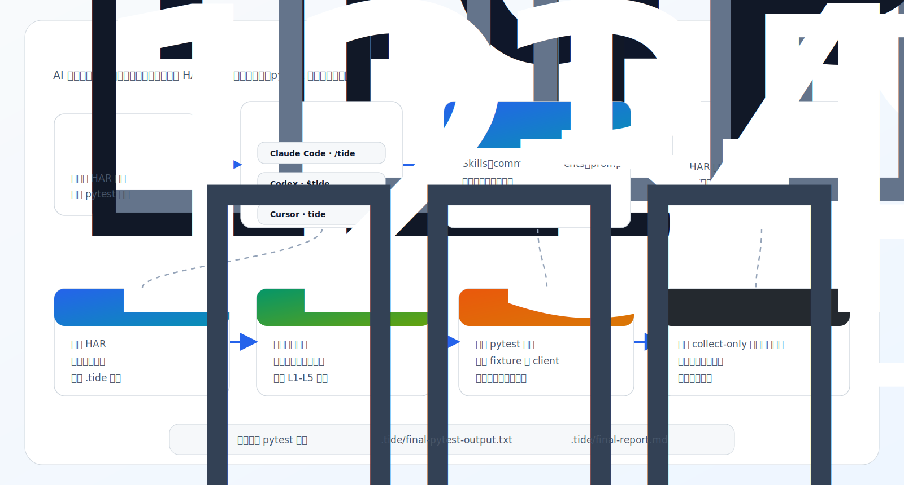

<div align="center">

# Tide

**HAR 驱动、源码感知的 pytest 接口自动化测试生成插件。**

把浏览器 HAR 录制文件转成贴合项目风格的 pytest 接口测试：自动扫描项目约定、规划 L1-L5 断言，并用确定性质量门验证生成结果。

<p>
  中文 | <a href="./README-EN.md">English</a>
</p>

<p>
  <a href="./pyproject.toml"></a>
  <a href="./pyproject.toml"></a>
  <a href="https://docs.astral.sh/uv/"></a>
  <a href="https://pytest.org/"></a>
  <a href="./LICENSE"></a>
</p>

<p>
  
  
  
</p>

```text
/using-tide
/tide ./recordings/api.har
```

</div>

---

## 概览

Tide 是一套面向 API 自动化项目的 AI 插件工作流与确定性 Python 执行层。

它尤其适合已有 pytest 接口自动化项目：生成测试前会扫描仓库里的 API client、fixture、命名风格、认证辅助函数、断言习惯和输出目录，让生成代码尽量像团队自己补进去的测试。



## 为什么用 Tide

| 能力 | 价值 |
|---|---|
| HAR 转 pytest | 把浏览器录制的业务流程转成可收集、可运行的 pytest 接口测试。 |
| 源码感知生成 | 有后端源码或 API 定义时，利用实现细节增强业务断言。 |
| 适配已有项目 | 自动扫描测试结构、fixture、API client、命名和断言辅助函数。 |
| L1-L5 分层断言 | 从传输成功到状态变更、端到端业务结果逐层规划断言。 |
| 确定性质量门 | 校验 HAR 解析、场景结构、断言覆盖、写入范围和 pytest 输出。 |
| 多宿主支持 | 同一套核心资产同时支持 Claude Code、Codex 和 Cursor。 |

> [!IMPORTANT]
> Tide 默认只应写入生成测试和 `.tide/` 状态文件。除非用户明确授权，不应修改业务代码、共享配置或敏感信息。

## 支持的宿主

| 宿主 | 用户入口 | Tide 资产 |
|---|---|---|
| Claude Code | `/using-tide`、`/tide <har-file>` | `.claude-plugin/`、`skills/`、`agents/`、`prompts/`、`scripts/` |
| Codex | `$using-tide`、`$tide <har-file>` | `.codex-plugin/`、`codex-skills/`、`commands/`、`.agents/plugins/` |
| Cursor | `using-tide`、`tide <har-file>` | `.cursor/rules/`、`.cursor/commands/` |

宿主适配文件只负责命令语义和工具语义差异；`scripts/` 下的确定性执行层由所有宿主共享。

## 快速开始

### 前置要求

- Python `3.12+`
- `uv`
- 一个 pytest 接口自动化项目
- 从浏览器导出的 `.har` 文件

### Claude Code

```bash
claude plugins marketplace add koco-co/tide
claude plugins install tide
```

然后在目标自动化项目里运行：

```text
/using-tide
/tide ./recordings/api.har
```

本地插件开发方式：

```bash
git clone https://github.com/koco-co/tide.git ~/.claude/plugins/tide
cd ~/.claude/plugins/tide
uv sync
```

如果你的 Claude Code 环境需要命名空间命令：

```text
/tide:tide ./recordings/api.har --yes --non-interactive
```

### Codex

Tide 内置 Codex 插件元数据和技能：

```text
.codex-plugin/plugin.json
codex-skills/tide/SKILL.md
codex-skills/using-tide/SKILL.md
commands/tide.md
commands/using-tide.md
```

在 Codex 中安装或重载本地 Tide 插件后，在目标项目中使用：

```text
$using-tide
$tide ./recordings/api.har
```

Codex 适配层会把已安装插件根目录解析为 `TIDE_PLUGIN_DIR`，并从插件环境运行 Tide 脚本。目标项目的 Python 只用于执行生成后的 pytest 测试。

### Cursor

Tide 内置 Cursor 规则和命令文档：

```text
.cursor/rules/tide-core.mdc
.cursor/rules/tide-init.mdc
.cursor/commands/tide.md
.cursor/commands/using-tide.md
```

在 Cursor 中打开带有 Tide 规则的目标项目后运行：

```text
using-tide
tide ./recordings/api.har
```

## 工作流

Tide 使用四波工作流。AI 负责项目理解与测试设计，脚本负责解析、规范化和验证。

| 波次 | 目标 | 典型产物 |
|---|---|---|
| 1. 准备 | 解析 HAR 并扫描项目约定。 | `.tide/parsed.json`、`.tide/project-assets.json`、`.tide/convention-fingerprint.yaml` |
| 2. 理解 | 识别场景、请求链路、风险点和断言机会。 | `.tide/scenarios.json`、`.tide/generation-plan.json` |
| 3. 生成 | 复用本地 helper 和风格写入 pytest 文件。 | `testcases/` 或配置目录下的生成测试 |
| 4. 验证 | 运行窄范围校验并输出证据报告。 | `.tide/final-pytest-output.txt`、`.tide/final-report.md` |

典型运行方式：

```bash
# 在 AI 宿主中打开目标 pytest 自动化项目。
/using-tide
/tide ./recordings/metadata-sync.har

# 验证生成测试。
python -m pytest --collect-only testcases -q
python -m pytest testcases -q
```

## 断言模型

| 层级 | 含义 | 示例 |
|---|---|---|
| L1 | 传输成功 | HTTP 状态码、响应存在、请求完成 |
| L2 | API 契约 | `code == 0`、必需字段、稳定字段类型 |
| L3 | 业务响应 | 创建名称、同步状态、列表包含目标对象 |
| L4 | 状态变更 | 通过后续查询验证创建、更新、删除效果 |
| L5 | 端到端链路 | 多步骤流程到达最终可观察业务状态 |

> [!NOTE]
> 写操作场景应包含 L4，链路场景应包含 L5。即使格式化和 pytest 收集通过，缺失必需断言层时 Tide 的断言门也必须把该次运行标记为失败。

## 质量门

| 质量门 | 要求 |
|---|---|
| 可收集性 | 生成测试通过 `pytest --collect-only`。 |
| 项目契合度 | import、fixture、API client、类粒度和命名遵循本地 anchor。 |
| 断言覆盖 | 每个接口包含 L1-L3；写操作包含 L4；链路场景包含 L5。 |
| 数据安全 | 不硬编码活动环境 URL、token、webhook secret、凭据或不稳定运行时 ID。 |
| 场景完整性 | `scenario_id` 唯一，confidence 有证据支撑。 |
| 写入范围 | 生成内容限制在批准的测试目录和 `.tide/` 路径内。 |

严格运行时，Tide 会记录真实的最终 pytest 输出：

```text
.tide/final-pytest-output.txt
```

没有这个文件时，不应把运行总结为成功。

## 配置

Tide 把目标项目状态和配置存放在 `.tide/` 下。

```text
.tide/tide-config.yaml
.tide/repo-profiles.yaml
```

最小 `tide-config.yaml`：

```yaml
project:
  type: existing_automation
  language: python
  test_framework: pytest

paths:
  tests: testcases
  api_clients: api
  config: config
  utilities: utils

generation:
  assertion_policy: l1_l5
  prefer_existing_helpers: true
  no_source_mode: false

safety:
  forbid_hardcoded_base_url: true
  forbid_plaintext_secrets: true
  write_scope:
    - testcases
    - .tide
```

最小 `repo-profiles.yaml`：

```yaml
repositories:
  backend:
    path: ../backend
    role: source_trace
    optional: true

  automation:
    path: .
    role: pytest_target
    optional: false
```

敏感信息应放在环境变量或被版本控制排除的本地 `.env` 中。生成测试应引用项目已有的认证和环境 helper，而不是嵌入 HAR 中捕获的 token。

## 模式

| 模式 | 适用场景 | 行为 |
|---|---|---|
| Source-aware | 可访问后端源码或 API 定义。 | 追踪端点、推断状态转移，并增强 L4/L5 断言。 |
| No-source | 只有 HAR 证据和目标自动化项目。 | 基于观测响应、请求链路、命名启发和诚实的置信度标签生成测试。 |

No-source 模式仍应生成有用测试，但不应假装知道未被观测到的后端内部逻辑。

## 确定性核心

| 脚本 | 作用 |
|---|---|
| `scripts.har_parser` | 解析并规范化 HAR 录制文件。 |
| `scripts.convention_scanner` | 提取 pytest 项目约定和可复用资产。 |
| `scripts.scenario_validator` | 校验场景结构和证据。 |
| `scripts.scenario_normalizer` | 修复并规范化场景和生成计划文件。 |
| `scripts.deterministic_case_writer` | 当模型生成停滞时产出 fallback pytest 文件。 |
| `scripts.generated_assertion_gate` | 强制检查生成测试中的必需断言层。 |
| `scripts.write_scope_guard` | 限制写入在批准路径内。 |

脚本应从 Tide 插件环境运行：

```bash
cd /path/to/tide
PYTHONPATH="$PWD:$PYTHONPATH" uv run python3 -m scripts.har_parser --help
```

## 仓库结构

```text
tide/
├── .claude-plugin/       # Claude Code 插件元数据
├── .codex-plugin/        # Codex 插件元数据
├── .cursor/              # Cursor 规则和命令
├── .agents/plugins/      # 本地 Codex 插件 marketplace 入口
├── agents/               # 宿主侧 agent prompt
├── assets/               # README 和插件视觉资产
├── codex-skills/         # Codex 技能定义
├── commands/             # Codex slash-command 文档
├── prompts/              # Prompt 片段和风格规则
├── scripts/              # 确定性 Python 执行层
├── skills/               # Claude Code 技能定义
└── tests/                # 合约和脚本测试
```

## 开发

```bash
uv sync --all-extras
uv run pytest tests/test_skill_contract.py tests/test_agent_contracts.py tests/test_codex_plugin_contract.py -q
uv run pytest
```

校验插件元数据：

```bash
python3 -m json.tool .claude-plugin/plugin.json
python3 -m json.tool .codex-plugin/plugin.json
python3 -m json.tool .agents/plugins/marketplace.json
```

## Roadmap

- 面向已有测试套件的增量生成。
- 更强的 no-source 置信度评分。
- 生成测试校验的 CI 模板。
- 可选的显式并行 agent 编排。
- 更多常见 pytest API 自动化栈的项目 profile。

## License

[MIT](./LICENSE)
