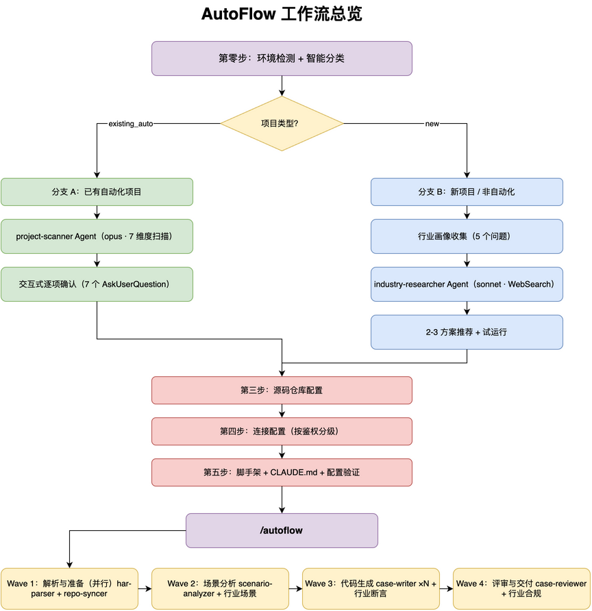

<div align="center">

<picture>
  <source media="(prefers-color-scheme: dark)" srcset="https://img.shields.io/badge/Sisyphus--AutoFlow-1.2-7C3AED?style=for-the-badge&logoColor=white">
  
</picture>

#  Sisyphus-AutoFlow

### HAR-Driven, Source-Aware API Test Generation

<br />

**一句话说清**：丢入浏览器 HAR 抓包，自动出生产级 pytest 测试套件。

基于 **Claude Code Plugin** 构建的 AI 接口自动化测试生成引擎，5 个 Agent 协同、4 波并行编排。

<br />

📡 HAR 解析 &nbsp;·&nbsp; 🔍 源码追踪 &nbsp;·&nbsp; 🧪 L1-L5 断言 &nbsp;·&nbsp; ⚡ 并行生成 &nbsp;·&nbsp; 📊 Allure 报告

<br />

[](https://python.org/)
[](https://claude.ai/code)
[](https://pytest.org/)
[](./LICENSE)
[](./pyproject.toml)

<br />

```
📡 HAR ─── /autoflow ──→ 🔍 源码分析 ──→ 🧪 pytest 测试套件 ──→ 📊 Allure 报告
```

</div>

<br />

---

## 目录

- [核心特性](#核心特性)
- [工作流总览](#工作流总览)
- [断言层级](#断言层级)
- [快速开始](#快速开始)
- [使用指南](#使用指南)
- [融入已有项目](#融入已有项目)
- [配置参考](#配置参考)
- [项目结构](#项目结构)
- [开发](#开发)
- [Roadmap](#roadmap)
- [License](#license)

---

## 核心特性

| 特性 | 说明 |
|------|------|
| **HAR → pytest** | 浏览器录制的 HAR 文件自动转化为生产级 pytest 测试套件，零样板代码 |
| **源码感知** | 读取后端源码（Controller → Service → DAO），深度理解业务逻辑 |
| **L1-L5 断言** | 从 HTTP 状态码（L1）到 AI 推断的隐式业务规则（L5），5 层断言递进覆盖 |
| **5 Agent 协同** | har-parser · repo-syncer · scenario-analyzer · case-writer · case-reviewer |
| **4 波并行编排** | 解析 → 分析 → 生成 → 评审，波次内并行、波次间串行，充分利用 AI 能力 |
| **智能项目分类** | 自动检测已有自动化项目 vs 新项目，阈值保守、不误判覆盖 |
| **行业感知** | 收集行业画像 → AI 调研 → 2-3 方案推荐，行业断言全流程贯穿 |
| **方案推荐** | 基于行业/团队/鉴权复杂度，推荐完整技术方案（框架+CI+报告+Mock+数据管理） |
| **旧项目无侵入** | 自动检测已有项目的测试目录、API 封装、断言风格，沿用原有规范 |
| **交互式确认** | 每个关键节点提供确认清单，支持 `--quick` 跳过和断点恢复 |
| **验证透明** | 每波次结束明确输出验证摘要（py_compile / import 检查 / 断言覆盖率） |

---

## 工作流总览



<details>
<summary><b>4 波次详解</b></summary>

### Wave 1：解析与准备（并行）

| Agent | 模型 | 输入 | 输出 |
|-------|------|------|------|
| **har-parser** | haiku | HAR 文件 | `.autoflow/parsed.json` |
| **repo-syncer** | haiku | `repo-profiles.yaml` | `.autoflow/repo-status.json` |

两个 Agent 并行执行。无源码仓库时自动跳过 repo-syncer。

### Wave 2：场景分析（交互式）

| Agent | 模型 | 职责 |
|-------|------|------|
| **scenario-analyzer** | opus | 源码追踪 + 场景推断 + 断言计划 |

- 追踪 Controller → Service → DAO 调用链
- 推断正常路径、异常路径、边界值、CRUD 闭环等 8 种场景类别
- 规划每个场景的 L1-L5 断言层级
- 生成确认清单，用户确认后继续

### Wave 3：代码生成（并行扇出）

| Agent | 模型 | 职责 |
|-------|------|------|
| **case-writer ×N** | sonnet | 按模块并行生成 pytest 测试文件 |

- 每个服务模块独立一个 Agent
- 遵循项目已有的代码风格（API 封装、Request 工具类、allure 标注等）
- 生成后自动进行 py_compile 验证

### Wave 4：评审与交付（交互式）

| Agent | 模型 | 职责 |
|-------|------|------|
| **case-reviewer** | opus | 5 维评审 + 自动修复 + 执行 |

5 个评审维度：
1. **断言完整性** — L1-L5 逐层验证
2. **场景完整性** — CRUD 闭环、异常路径、边界值
3. **源码交叉核验** — 断言值与源码实际逻辑一致
4. **代码质量** — 无硬编码、不可变模式、规模限制
5. **可运行性** — 导入完整、语法正确、fixture 可用

偏差率处理：`< 15%` 静默修复 · `15-40%` 修复并警告 · `> 40%` 阻断

</details>

---

## 断言层级


| 层级 | 名称 | 覆盖内容 | 生成条件 |
|------|------|----------|----------|
| **L1** | 协议层 | HTTP 状态码 · 响应时间 · Content-Type | 所有接口（100%） |
| **L2** | 结构层 | Schema 验证 · 字段类型 · 存在性检查 | 有响应体的接口 |
| **L3** | 数据层 | 值范围 · 枚举合法性 · 分页不变量 | 有源码参考时 |
| **L4** | 业务层 | 状态机 · CRUD 一致性 · 数据库验证 | 配置了数据库连接 |
| **L5** | AI 推断层 | 隐式规则 · 安全边界 · 异常路径 | 源码追踪 + 高置信度 |

每层断言代码示例参见 [references/assertion-examples.md](references/assertion-examples.md)。

---

## 快速开始

### 前置条件

- [Claude Code](https://claude.ai/code) 已安装
- Python >= 3.12
- [uv](https://docs.astral.sh/uv/) 包管理器（推荐）或 pip
- Git

### 安装

```bash
# 1. 添加仓库为 marketplace
claude plugins marketplace add koco-co/sisyphus-autoflow

# 2. 安装插件
claude plugins install sisyphus-autoflow

# 验证安装
claude plugins list
```

<details>
<summary><b>其他安装方式</b></summary>

**全局安装（所有项目可用）：**

```bash
git clone https://github.com/koco-co/sisyphus-autoflow.git ~/.claude/plugins/sisyphus-autoflow
cd ~/.claude/plugins/sisyphus-autoflow && uv sync
```

**项目级安装：**

```bash
mkdir -p .claude/plugins
git clone https://github.com/koco-co/sisyphus-autoflow.git .claude/plugins/sisyphus-autoflow
cd .claude/plugins/sisyphus-autoflow && uv sync && cd ../../..
```

</details>

### 初始化 + 生成

```bash
# 1. 进入测试项目目录
cd /path/to/your-test-project

# 2. 初始化环境（首次使用，在 Claude Code 中输入）
/using-autoflow

# 3. 丢入 HAR 文件，生成测试套件
/autoflow ./recordings/api.har
```

---

## 使用指南

### 步骤 1：初始化项目

在 Claude Code 中输入：

```
/using-autoflow
```

交互式向导会引导完成：

交互式向导会根据项目类型自动选择路径：

**已有自动化项目（自动检测）：**

| 步骤 | 说明 |
|------|------|
| 环境检测 + 智能分类 | 自动判定为已有项目 |
| 深度扫描 (project-scanner) | opus Agent 通读项目代码，输出 7 维度分析 |
| 交互式确认 | 架构、代码风格、鉴权、工具链、Allure、数据管理、行业 — 逐项确认 |
| 仓库配置 | 输入后端仓库 URL，自动 clone + URL 前缀映射 |
| 连接配置 | Base URL · 认证（可复用旧项目逻辑）· 数据库 · 通知 |
| 配置验证 | 自动 smoke test：URL 可达 + 认证有效 + DB 连接 |

**新项目 / 非自动化项目：**

| 步骤 | 说明 |
|------|------|
| 环境检测 + 智能分类 | 自动判定为新项目 |
| 行业画像收集 | 行业、系统类型、团队规模、特殊需求、鉴权复杂度 |
| AI 调研 (industry-researcher) | sonnet Agent 网络搜索行业最佳实践 |
| 方案推荐 | 展示 2-3 个完整技术方案，用户选择 |
| 方案试运行 | 生成最小示例测试文件，确认风格后全量生成 |
| 仓库配置 + 连接配置 + 配置验证 | 同上 |

生成配置文件：`repo-profiles.yaml` · `autoflow-config.yaml` · `CLAUDE.md`

### 步骤 2：录制 HAR 文件

在浏览器开发者工具 Network 面板中操作目标系统，导出 `.har` 文件。

### 步骤 3：生成测试

```bash
# 标准模式（全流程 + 交互确认）
/autoflow ./recordings/api.har

# 快速模式（跳过确认清单）
/autoflow ./recordings/api.har --quick

# 恢复中断的会话
/autoflow --resume
```

### 步骤 4：验收

生成完成后，AutoFlow 会输出精确的验收命令：

```bash
# 预检（仅收集，不执行）
pytest tests/interface/ tests/scenariotest/ --collect-only

# 执行测试 + 生成 Allure 结果
pytest tests/interface/ tests/scenariotest/ -v --alluredir=.autoflow/allure-results

# 查看 Allure 报告
allure serve .autoflow/allure-results
```

> 注：实际命令会根据项目的包管理器（uv/pip/poetry）和测试目录自动适配。

---

## 融入已有项目

### 场景 A：全新项目

```bash
mkdir my-api-tests && cd my-api-tests && git init
# 在 Claude Code 中：/using-autoflow
```

向导会创建完整的项目脚手架：`tests/` · `core/` · `conftest.py` · `pyproject.toml` · `Makefile`

### 场景 B：已有自动化项目

```bash
cd /path/to/existing-test-project
# 在 Claude Code 中：/using-autoflow
```

**向导会自动检测项目类型，派 Agent 深度扫描 7 个维度：**

| 维度 | 检测内容 |
|------|---------|
| 项目架构 | 测试入口目录、子目录结构、conftest 层级 |
| 代码风格 | API 封装模式、Request 工具类、断言风格 |
| 鉴权方式 | 认证类位置、Cookie/Token/OAuth2 |
| 依赖工具链 | Python 版本、包管理器、HTTP 客户端 |
| Allure 模式 | 装饰器层级、step 使用率 |
| 数据管理 | 数据来源、parametrize、清理策略 |
| 行业上下文 | AI 推断行业/领域、合规要求 |

每个维度逐项确认后写入配置。**原则：项目已有规范 > 行业规则 > 插件默认规范。**

### 场景 C：纯脚本模式（不使用 Claude Code）

```bash
git clone https://github.com/koco-co/sisyphus-autoflow.git
cd sisyphus-autoflow && uv sync

# HAR 解析
uv run python -c "
from scripts.har_parser import parse_har
from pathlib import Path
result = parse_har(Path('your.har'), Path('repo-profiles.yaml'))
print(f'解析到 {len(result.endpoints)} 个接口')
"
```

> 纯脚本模式仅提供 HAR 解析、脚手架、通知等基础工具，不含 AI 场景分析和用例生成。

---

## 配置参考

### repo-profiles.yaml

```yaml
repos:
  - name: backend-service
    local_path: .repos/group/backend/
    remote: https://git.example.com/group/backend.git
    branch: release_1.0
    url_prefixes:
      - /api/v1
```

### autoflow-config.yaml

```yaml
project:
  type: existing          # existing | new
  test_dir: testcases     # 测试入口目录
  test_types:             # 要生成的测试类型
    - interface
    - scenariotest
  code_style:
    api_pattern: enum     # enum | constant | inline
    request_class: BaseRequests
    assertion_style: "resp['code'] == 1"
    auth_method: reuse    # cookie | token | password | none | reuse
    allure_enabled: true
  package_manager: pip    # uv | pip | poetry

# 行业信息（由 /using-autoflow 自动生成）
industry:
  domain: "金融/银行"
  system_type: "微服务架构"
  team_size: "3-5人"
  auth_complexity: complex
  special_needs: ["multi_env"]
  compliance: ["等保三级", "数据脱敏"]

solution:
  name: "金融级 API 自动化方案"
  fit_score: 92
  stack:
    framework: pytest
    http_client: httpx
    report: allure
    mock: wiremock
    ci: github_actions
    data_management: factory_boy
  industry_specific:
    - "金融交易幂等性断言"
    - "敏感数据字段脱敏验证"
```

### 环境变量（.env）

| 变量名 | 必填 | 说明 |
|--------|------|------|
| `BASE_URL` | 是 | 被测服务基础 URL |
| `AUTH_COOKIE` | 否 | 认证 Cookie（或 `AUTH_TOKEN`） |
| `DB_PASSWORD` | 否 | 数据库密码（L4 断言需要） |
| `DINGTALK_WEBHOOK` | 否 | 钉钉 Webhook |
| `FEISHU_WEBHOOK` | 否 | 飞书 Webhook |
| `SLACK_WEBHOOK` | 否 | Slack Webhook |

---

## 项目结构

```text
sisyphus-autoflow/
├── skills/                          # Claude Code 技能定义
│   ├── autoflow/SKILL.md            #   /autoflow — 主流程（4 波编排）
│   └── using-autoflow/SKILL.md      #   /using-autoflow — 初始化向导
├── agents/                          # 5 个 Agent 定义
│   ├── har-parser.md                #   HAR 解析（haiku）
│   ├── repo-syncer.md               #   仓库同步（haiku）
│   ├── scenario-analyzer.md         #   场景分析（opus）
│   ├── case-writer.md               #   代码生成（sonnet）
│   ├── case-reviewer.md             #   评审修复（opus）
│   ├── project-scanner.md           #   项目深度扫描（opus）
│   └── industry-researcher.md       #   行业调研（sonnet）             #   评审修复（opus）
├── prompts/                         # Agent 规范文档
│   ├── assertion-layers.md          #   L1-L5 断言规范
│   ├── code-style-python.md         #   Python 测试代码风格
│   ├── har-parse-rules.md           #   HAR 解析过滤规则
│   ├── review-checklist.md          #   评审清单与质量标准
│   ├── scenario-enrich.md           #   8 种场景类别生成策略
│   └── industry-assertions.md       #   行业特定断言规范           #   8 种场景类别生成策略
├── scripts/                         # Python 工具库
│   ├── har_parser.py                #   HAR 解析与去重
│   ├── scaffold.py                  #   脚手架生成（new/existing 模式）
│   ├── state_manager.py             #   波次检查点管理
│   ├── test_runner.py               #   pytest 执行包装（uv/pip/poetry）
│   ├── repo_sync.py                 #   Git 同步
│   └── notifier.py                  #   钉钉/飞书/Slack 通知
├── templates/                       # Jinja2 模板
├── references/                      # 参考文档
├── assets/                          # 流程图资源
├── .claude-plugin/                  # 插件元数据
├── pyproject.toml                   # 项目配置
├── Makefile                         # 开发命令
└── LICENSE
```

---

## 开发

```bash
git clone https://github.com/koco-co/sisyphus-autoflow.git
cd sisyphus-autoflow
uv sync --dev

make test       # 运行测试
make lint       # ruff 代码检查
make typecheck  # pyright 类型检查
make ci         # lint + typecheck + test
make fmt        # 代码格式化
```

---

## Roadmap

| 版本 | 主要特性 |
|------|---------|
| **v1.0** | HAR 解析 · 4 波编排 · L1-L5 断言 · DB 验证 · 检查点恢复 · 外部通知 |
| **v1.1** | 旧项目适配 · 验证透明度 · 验收命令优化 · 路径修复 · 测试类型选择 |
| **v1.2**（当前） | 智能项目分类 · 7 维度深度扫描 · 行业画像与 AI 调研 · 方案推荐 · 配置验证 · 全流程行业感知 |
| v1.3 | 多语言后端支持（TypeScript · Go · Python 后端） |
| v1.3 | OpenAPI / Swagger spec 作为补充输入源 |
| v2.0 | UI 自动化集成（Playwright）· 性能测试 |

---

## Contributing

欢迎提交 Issue 和 Pull Request。提交前请确保：

```bash
make ci   # 所有检查通过
```

---

## License

[MIT](./LICENSE) &copy; 2026 Sisyphus-AutoFlow contributors
