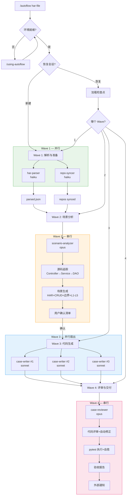
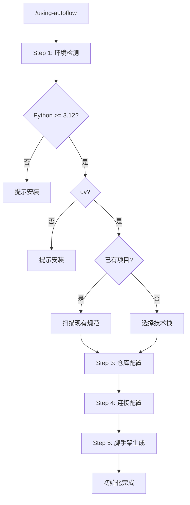

# sisyphus-autoflow

> HAR 驱动、源码感知的 API 接口自动化测试 — 由 Claude Code 驱动

[](LICENSE)
[](pyproject.toml)
[](PLUGIN.md)

---

## Features

- **HAR → pytest**：丢入浏览器录制的 HAR 文件，自动获得生产级 pytest 测试套件，无需手写样板代码
- **源码感知**：读取后端源码（Controller → Service → DAO），深度理解业务逻辑，生成有意义的断言
- **L1-L5 断言层级**：覆盖从 HTTP 状态码验证（L1）到 AI 推断的隐式业务规则（L5）的完整断言体系
- **多 Agent 协同**：5 个专业 AI Agent 组成 4 波并行编排流水线，充分利用模型能力分工
- **交互式确认**：AI 提议测试场景清单，你确认后再生成代码 — 始终掌控生成结果

---

## Quick Start

```bash
# 安装（Claude Code Plugin 方式）
# 在 Claude Code 中运行：
/using-autoflow

# 首次运行：初始化项目环境
# 在 Claude Code 中输入：
/using-autoflow

# 生成测试套件
/autoflow ./recordings/api.har
```

---

## How It Works

sisyphus-autoflow 将 HAR 文件到测试套件的全过程分为 4 个执行波次，每波内部按依赖关系选择并行或串行调度：



---

## Assertion Layers（断言层级）

测试用例按照 5 层断言体系组织，层层递进，从协议合规到 AI 推断的隐式业务规则：

```mermaid
graph LR
    subgraph L1["L1 协议层"]
        L1a[HTTP 状态码]
        L1b[响应时间]
        L1c[Content-Type]
    end
    subgraph L2["L2 结构层"]
        L2a[Pydantic 模型]
        L2b[字段存在性]
        L2c[类型正确性]
    end
    subgraph L3["L3 数据层"]
        L3a[值范围]
        L3b[枚举合法性]
        L3c[格式校验]
    end
    subgraph L4["L4 业务层"]
        L4a[状态机]
        L4b[CRUD 一致性]
        L4c[数据库验证]
    end
    subgraph L5["L5 AI推断层"]
        L5a[隐式规则]
        L5b[安全边界]
        L5c[异常路径]
    end
    L1 --> L2 --> L3 --> L4 --> L5
    style L1 fill:#c8e6c9,stroke:#388e3c
    style L2 fill:#bbdefb,stroke:#1976d2
    style L3 fill:#fff9c4,stroke:#f9a825
    style L4 fill:#ffccbc,stroke:#e64a19
    style L5 fill:#e1bee7,stroke:#8e24aa
```



每层断言示例参见 [references/assertion-examples.md](references/assertion-examples.md)。

---

## Installation（安装）

### 方式一：Claude Code Plugin（推荐）

确保已安装 [Claude Code](https://claude.ai/code)，然后在对话中运行：

```
/using-autoflow
```

插件会自动完成环境检测、依赖安装和项目脚手架生成。

### 方式二：GitHub Clone

```bash
# 克隆仓库
git clone https://github.com/your-org/sisyphus-auto-flow.git
cd sisyphus-auto-flow

# 安装依赖（需要 uv）
uv sync

# 安装 Claude Code Plugin
cp -r agents/* ~/.claude/agents/
cp -r skills/* ~/.claude/skills/
```

---

## Usage（使用）

### 步骤 1：初始化项目环境

第一次使用时，在 Claude Code 中运行：

```
/using-autoflow
```

向导将引导你完成：
- Python 3.12+ 与 uv 环境检测
- 目标仓库配置（`repo-profiles.yaml`）
- 数据库与服务连接配置（`.env`）
- 测试项目脚手架生成

### 步骤 2：录制 HAR 文件

在浏览器开发者工具（Network 面板）中操作目标系统，导出 `.har` 文件。

### 步骤 3：生成测试套件

```
/autoflow ./recordings/checkout-flow.har
```

**带参数示例：**

```
# 指定目标模块，跳过 L5 AI 推断（节省 token）
/autoflow ./recordings/user-api.har --module user --skip-l5

# 恢复上次中断的会话
/autoflow --resume

# 只生成场景清单，不生成代码（用于预览）
/autoflow ./recordings/order.har --dry-run
```

---

## Configuration（配置）

### repo-profiles.yaml

定义需要同步和分析的源码仓库：

```yaml
# repo-profiles.yaml
profiles:
  - name: backend-api          # 仓库标识，用于 --module 参数
    repo_url: git@github.com:your-org/backend.git
    branch: main
    source_root: src/main/java  # 源码根目录（相对仓库根）
    patterns:                   # 需要追踪的包路径模式
      - "com.example.api.controller"
      - "com.example.api.service"
      - "com.example.api.dao"
    language: java              # java | python | typescript | go
    db_schema_path: docs/schema.sql  # 可选：数据库 schema 文件路径
```

完整字段说明见 [docs/repo-profiles-schema.md](docs/repo-profiles-schema.md)。

### 环境变量（.env）

| 变量名 | 必填 | 说明 |
|--------|------|------|
| `ANTHROPIC_API_KEY` | 是 | Anthropic API 密钥 |
| `TEST_BASE_URL` | 是 | 被测服务基础 URL，如 `http://localhost:8080` |
| `DB_HOST` | 否 | 数据库主机（L4 数据库验证需要） |
| `DB_PORT` | 否 | 数据库端口 |
| `DB_NAME` | 否 | 数据库名称 |
| `DB_USER` | 否 | 数据库用户名 |
| `DB_PASSWORD` | 否 | 数据库密码 |
| `NOTIFY_WEBHOOK_URL` | 否 | Wave 4 完成后的 Webhook 通知地址 |
| `NOTIFY_CHANNEL` | 否 | 通知渠道：`slack` \| `dingtalk` \| `feishu` |

---

## Project Structure（生成的项目结构）

`/autoflow` 执行完成后，工作目录结构如下：

```
<your-test-project>/
├── conftest.py                  # pytest fixtures（认证、客户端、数据库连接）
├── pyproject.toml               # 项目依赖与工具配置
├── .env                         # 环境变量（已加入 .gitignore）
├── repo-profiles.yaml           # 仓库配置
│
├── tests/
│   ├── __init__.py
│   ├── test_<module>_list.py    # 列表查询测试（L1-L5）
│   ├── test_<module>_detail.py  # 详情查询测试
│   ├── test_<module>_create.py  # 创建操作测试
│   ├── test_<module>_update.py  # 更新操作测试
│   ├── test_<module>_delete.py  # 删除操作测试
│   └── test_<module>_edge.py    # 边界与异常场景测试
│
├── models/
│   └── <module>.py              # Pydantic 响应模型（自动生成）
│
├── utils/
│   ├── auth.py                  # 认证工具函数
│   ├── db.py                    # 数据库辅助函数（L4 验证）
│   └── assertions.py            # 自定义断言辅助函数
│
└── reports/
    └── .gitkeep                 # Allure/pytest-html 报告输出目录
```

---

## Development（开发）

### Prerequisites

- Python 3.12+
- [uv](https://docs.astral.sh/uv/) 包管理器
- [Claude Code](https://claude.ai/code)

### 本地开发

```bash
# 克隆并安装依赖
git clone https://github.com/your-org/sisyphus-auto-flow.git
cd sisyphus-auto-flow
uv sync

# 运行测试
make test

# 代码检查
make lint

# 类型检查
make typecheck

# 一键运行所有检查
make check
```

### 可用的 Make 目标

```bash
make test        # 运行 pytest（含覆盖率报告）
make lint        # 运行 ruff 代码检查
make typecheck   # 运行 pyright 类型检查
make format      # 运行 ruff format 格式化
make check       # 依次运行 lint + typecheck + test
make clean       # 清理 __pycache__、.pytest_cache 等临时文件
```

技术栈选型说明见 [references/tech-stack-options.md](references/tech-stack-options.md)。

---

## 初始化流程

`/using-autoflow` 命令执行的完整步骤：



**各步骤说明：**

| 步骤 | 说明 |
|------|------|
| Step 1 环境检测 | 检查 Python 版本、uv、git 是否满足要求 |
| Step 2 项目识别 | 判断当前目录是否已有测试项目（检测 `conftest.py`、`pyproject.toml`） |
| Step 3 仓库配置 | 引导填写 `repo-profiles.yaml`，配置需要同步的源码仓库 |
| Step 4 连接配置 | 引导填写 `.env`，配置被测服务 URL 和数据库连接信息 |
| Step 5 脚手架生成 | 生成 `conftest.py`、`pyproject.toml`、目录结构、`.gitignore` |

---

## Roadmap

| 版本 | 状态 | 主要特性 |
|------|------|---------|
| v0.1.0 | 已完成 | HAR 解析、场景生成、基础 L1-L3 断言、pytest 输出 |
| v0.2.0 | 进行中 | L4 数据库验证、CRUD 一致性检查、检查点恢复 |
| v0.3.0 | 计划中 | L5 AI 推断断言、安全边界检测 |
| v0.4.0 | 计划中 | 多语言后端支持（TypeScript、Go） |
| v0.5.0 | 计划中 | CI 集成、GitHub Actions 模板 |
| v1.0.0 | 计划中 | 完整文档、稳定 API、社区版发布 |

---

## Contributing

欢迎贡献代码、文档和测试用例！请先阅读 [CONTRIBUTING.md](CONTRIBUTING.md)（待补充）。

提交 PR 前请确保：

```bash
make check   # 所有检查通过
```

---

## License

本项目基于 [MIT License](LICENSE) 开源。
