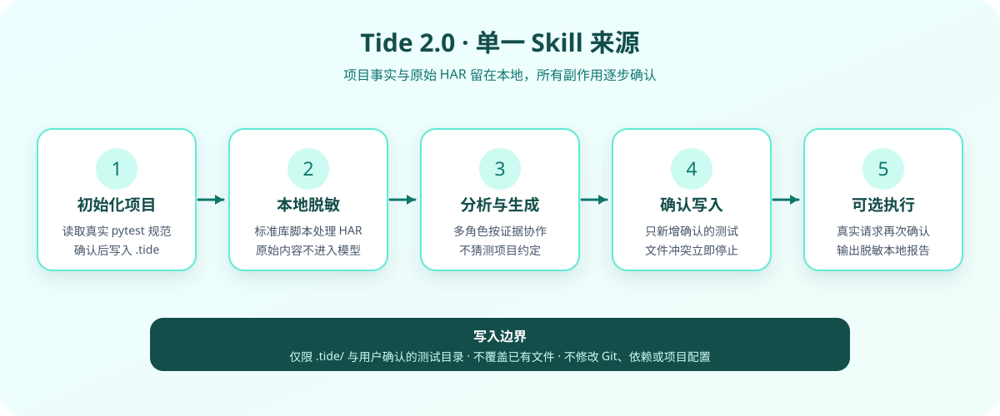

<div align="center">

# Tide

将浏览器 HAR 转换为符合已有项目规范的 pytest 接口测试。

**纯 Skills 插件 · 本地脱敏 · 源码感知 · 逐步确认**

</div>



## Tide 解决什么问题

录制 HAR 很容易，把流量整理成团队能够长期维护的接口测试却很费时间。Tide 会先读取已有 pytest 项目的真实结构和习惯，再分析经过本地脱敏的 HAR，生成与项目现有客户端、fixture、认证方式、命名和断言风格一致的候选测试。

Tide 不提供固定的“最佳项目模板”。项目规则来自当前项目证据，并且必须由用户确认后才写入 `.tide/`。

## 支持范围

- 已存在的 Python + pytest 接口自动化项目；
- macOS 或 Linux；
- 目标项目确认的 Python 版本，最低 Python 3.8；
- 单个本地 HAR 文件；
- 当前项目源码，以及用户逐项授权的额外本地只读源码目录；
- 生成新测试文件，以及用户再次确认后的可选真实执行。

以下能力不在范围内：创建新项目脚手架、安装依赖、修改项目配置、覆盖已有测试、同步 Git 仓库、外部通知、后台执行和跨会话续跑。

## 工作方式

### 1. 初始化项目

显式调用 `init-tide`。它会只读检查：

- Python 与 pytest 证据；
- 测试目录、文件命名和测试组织方式；
- 已有客户端、fixture、认证辅助函数和断言习惯；
- 项目认可的测试命令与安全环境；
- 当前源码和已明确授权的额外本地源码。

项目扫描、测试资产扫描和规则审查由不同角色完成。Tide 展示项目画像、拟生成规则和完整写入清单；只有用户确认后，才创建：

```text
.tide/
├── project-profile.json
└── rules/
    ├── <根据当前项目证据生成的规则>.md
    └── <按需生成的规则子目录>/...
```

### 2. 分析 HAR

显式调用 `tide` 并提供 HAR 路径。标准库脚本先在本地完成大小限制、结构校验、敏感字段过滤、脱敏和稳定摘要。原始 HAR、请求体、响应体、Cookie、凭据和个人信息不会进入任何角色上下文，也不会写入 `.tide/`。

场景分析结果必须先通过脚本校验并绑定当前画像、规则和脱敏摘要；用户确认该场景计划摘要后，Tide 才会生成测试候选。

### 3. 生成与审查

场景由确定性脚本从脱敏摘要提取并绑定；测试生成和结果审查由职责分离的角色完成。目标地址变量、运行时变量、生成状态、候选安全边界和审查摘要由脚本强制处理。所有项目风格只能来自已经确认的 `.tide/project-profile.json` 和 `.tide/rules/`；证据不足的业务断言必须降级、跳过或交给用户确认，不能靠模型猜测。

### 4. 写入与执行

写入测试代码前，Tide 会展示精确文件清单并再次请求确认：

- 只创建新文件；
- 已有文件冲突时停止；
- 不修改已有测试、fixture、客户端、配置或业务源码；
- 写入范围只允许 `.tide/` 与用户确认的测试目录。

默认只生成、不执行。真实执行 pytest 前会再次展示环境、目标、命令和测试范围。执行器只接受画像确认的锁定 runner 与字面 IP 目标；项目还必须有证据证明客户端从目标环境变量取址并明确关闭自动重定向。生产环境、未知环境、域名目标或 transport 证据不足时禁止执行。

## 安装

### Claude Code

```bash
claude plugin marketplace add /path/to/tide
claude plugin install tide@tide
```

本地开发时也可以直接加载仓库：

```bash
claude --plugin-dir /path/to/tide
```

### Codex

```bash
codex plugin marketplace add /path/to/tide
codex plugin add tide@tide
```

将 `/path/to/tide` 替换为本仓库的绝对路径。安装后重新开始会话，再显式调用需要的 Skill。

## 安全边界

- 原始 HAR 只由本地确定性脚本读取；
- 脱敏失败、输入异常、路径越界或证据不完整时失败关闭；
- 初始化、分析和生成阶段不访问网络；只有用户单独确认真实执行计划后才允许 pytest 发出请求；
- 额外源码目录在读取前逐项展示并确认，全程只读；
- 所有机器状态使用 JSON，运行记录位于 `.tide/runs/<run-id>/`；
- 每次真实请求都必须经过独立执行确认；
- 报告只包含脱敏状态、证据编号、文件清单和执行结果。

## 仓库结构

```text
.
├── .agents/plugins/marketplace.json
├── .claude-plugin/
│   ├── marketplace.json
│   └── plugin.json
├── .codex-plugin/plugin.json
├── .github/workflows/ci.yml
├── assets/
│   └── tide-architecture.svg
├── skills/
│   ├── init-tide/
│   └── tide/
├── CHANGELOG.md
├── LICENSE
└── README.md
```

`skills/` 是唯一 Skill 来源。仓库不存在宿主副本、生成镜像或第二套工作流。

## 本地校验

每个 Skill 的脚本都支持 `--help` 和 `--self-test`。提交前执行：

```bash
find skills -path '*/scripts/*.py' -type f -print0 | sort -z | \
  while IFS= read -r -d '' script; do \
    PYTHONDONTWRITEBYTECODE=1 python3 "$script" --help >/dev/null && \
    PYTHONDONTWRITEBYTECODE=1 python3 "$script" --self-test; \
  done

python3 /path/to/build-plugin/scripts/validate_plugin.py . \
  --platform dual --strict

claude plugin validate . --strict
```

静态校验只能证明目录、清单和脚本契约成立。真实宿主发现、真实项目生成和真实 HTTP 执行必须分别记录，不得互相替代。

## 许可证

[MIT](LICENSE)
