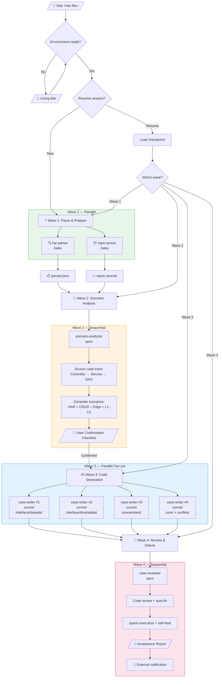
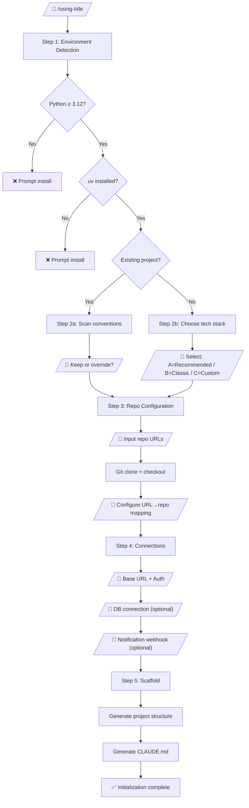

# Tide Plugin Design Spec

> Claude Code Plugin for API test automation — HAR-driven, source-aware, multi-agent orchestrated

## 1. Overview

### 1.1 What

A Claude Code Plugin (`tide`) that transforms HAR files into production-grade pytest test suites. It reads source code to understand business logic, generates L1-L5 layered assertions, and orchestrates multiple AI agents in a four-wave pipeline.

### 1.2 Why

No existing tool combines HAR input + source code analysis + interactive scenario enrichment + multi-layer assertion generation. The closest competitors (HttpRunner, Keploy, Schemathesis) each cover only one slice. This plugin fills the gap with an AI-native approach.

### 1.3 Core Differentiators

- **Dual input**: HAR (what the API does) + source code (what the API should do)
- **Interactive scenario enrichment**: AI proposes CRUD closures, edge cases, and implicit rules; user confirms
- **L1-L5 assertion depth**: From HTTP status codes to AI-inferred business rules and DB state verification
- **Wave-based orchestration**: Parallel where possible, checkpointed where needed

### 1.4 Key Decisions (from brainstorming)

| Decision | Choice |
|----------|--------|
| Project relationship | Standalone plugin (not part of qa-flow) |
| Distribution | Claude Code Plugin (installable via `claude plugins add`) |
| Test tech stack | pytest + httpx + pydantic + allure |
| API-to-repo mapping | Configuration file (`repo-profiles.yaml`) |
| DB assertions | Required from v1 (optional per-project config) |
| Notifications | Terminal AskUserQuestion + external webhook (DingTalk/Feishu/Slack) |
| Skill split | Two skills: `/using-tide` (init) + `/tide` (main workflow) |
| Test organization | `tests/{interface,scenariotest,unittest}/{service_module}/test_*.py` |
| Architecture | Wave-based hybrid orchestration (4 waves, 5 agents) |

---

## 2. Plugin Structure

```
tide/
├── README.md                               # GitHub README (Mermaid diagrams, badges, usage)
├── README_EN.md                            # English README (optional)
├── LICENSE                                 # MIT License
├── PLUGIN.md                               # Claude Code Plugin metadata
├── pyproject.toml                          # Plugin's own dev dependencies (uv + ruff + pytest)
├── Makefile                                # Dev shortcuts: test, lint, typecheck, release
├── skills/
│   ├── using-tide/
│   │   └── SKILL.md                        # Skill 1: Environment init wizard
│   └── tide/
│       └── SKILL.md                        # Skill 2: HAR→test main workflow
├── agents/
│   ├── har-parser.md                       # Wave1: HAR parse + dedup + filter
│   ├── repo-syncer.md                      # Wave1: Git repo sync
│   ├── scenario-analyzer.md                # Wave2: Source-aware scenario analysis
│   ├── case-writer.md                      # Wave3: Test code generation (fan-out)
│   └── case-reviewer.md                    # Wave4: Review + execution + fix
├── prompts/
│   ├── har-parse-rules.md                  # HAR filtering rules
│   ├── scenario-enrich.md                  # Scenario enrichment strategy
│   ├── assertion-layers.md                 # L1-L5 assertion generation rules
│   ├── code-style-python.md                # Python test code style guide
│   └── review-checklist.md                 # Review checklist
├── scripts/
│   ├── har_parser.py                       # Deterministic HAR JSON parsing
│   ├── repo_sync.py                        # Git clone/pull/checkout
│   ├── state_manager.py                    # Wave checkpoint state management
│   ├── scaffold.py                         # Project scaffolding generator
│   ├── notifier.py                         # External notification (webhook)
│   └── test_runner.py                      # pytest execution + result collection
├── tests/                                  # Plugin's own unit tests
│   ├── conftest.py                         # Shared test fixtures
│   ├── test_har_parser.py                  # HAR parsing + filtering + dedup
│   ├── test_repo_sync.py                   # Git operations mock tests
│   ├── test_state_manager.py               # Checkpoint state lifecycle
│   ├── test_scaffold.py                    # Project structure generation
│   ├── test_notifier.py                    # Webhook notification formatting
│   ├── test_runner_wrapper.py              # pytest execution + result collection
│   └── fixtures/                           # Test data
│       ├── sample.har                      # Minimal valid HAR file
│       ├── sample_dirty.har                # HAR with static resources + duplicates
│       ├── sample_repo_profiles.yaml       # Sample mapping config
│       └── sample_response.json            # Sample API response for model tests
├── templates/
│   ├── conftest.py.j2                      # pytest conftest template
│   ├── test_case.py.j2                     # Test case template
│   ├── pyproject.toml.j2                   # Project config template
│   └── .env.example                        # Env vars example
└── references/
    ├── assertion-examples.md               # Assertion examples library
    └── tech-stack-options.md               # Alternative tech stack docs
```

### 2.1 File Responsibilities

| Directory | Language | Purpose | Executed by |
|-----------|----------|---------|-------------|
| `skills/` | Markdown | SKILL.md entry points with frontmatter | Claude Code (skill loader) |
| `agents/` | Markdown | Subagent definitions (tools, model, instructions) | Claude Code (Agent tool) |
| `prompts/` | Markdown | Instruction templates referenced by agents | Agents (Read into context) |
| `scripts/` | Python | Deterministic operations (no AI needed) | Bash tool |
| `tests/` | Python | Plugin's own unit tests (pytest) | `uv run pytest` / CI |
| `templates/` | Jinja2 | Code generation templates | scaffold.py |
| `references/` | Markdown | Not loaded into context, manual reference only | Human |
| Root files | Mixed | README.md, LICENSE, pyproject.toml, Makefile, PLUGIN.md | GitHub / Claude Code |

---

## 3. Skill 1: /using-tide (Environment Init Wizard)

### 3.1 Frontmatter

```yaml
---
name: using-tide
description: "Initialize Tide environment — project scaffolding, repo config, tech stack setup. Use when: first run, /using-tide, 'initialize tide', 'setup tide'."
argument-hint: "[--force]"
user-invocable: true
allowed-tools: Read, Write, Edit, Bash, Glob, Grep, AskUserQuestion
---
```

### 3.2 Five-Step Flow

```
Step 1: Environment Detection
  ├─ Check: Python ≥ 3.12, uv, Git
  ├─ Detect: existing project (pyproject.toml?) or fresh project
  └─ Output: environment status summary

Step 2: Project Style Detection & Confirmation
  ├─ [Existing project] Scan pyproject.toml, .editorconfig, ruff.toml, existing tests
  │   → Extract current conventions → AskUserQuestion: keep or override?
  └─ [New project] AskUserQuestion: choose tech stack
      Options:
        A (Recommended): Python 3.13 + uv + ruff + pyright + pre-commit + rich + make
        B: Python 3.12 + pip + flake8 + mypy + pytest-html
        C: Custom input

Step 3: Source Code Repository Configuration
  ├─ AskUserQuestion: input repo URLs (batch supported)
  ├─ Parse group from URL: https://git.xxx.com/group1/repo1.git → .repos/group1/repo1/
  ├─ Git clone + checkout specified branch
  ├─ AskUserQuestion: URL prefix → repo mapping for each repo
  └─ Generate repo-profiles.yaml

Step 4: Connection Configuration
  ├─ AskUserQuestion: target base_url (e.g., http://172.16.115.247)
  ├─ AskUserQuestion: auth method (Cookie / Token / username+password)
  ├─ [Optional] AskUserQuestion: DB connection (host/port/user/password/db)
  ├─ [Optional] AskUserQuestion: notification webhook (DingTalk/Feishu/Slack)
  └─ Generate .env + .env.example

Step 5: Scaffold Generation + CLAUDE.md
  ├─ Run scaffold.py → generate project structure
  ├─ Auto-generate CLAUDE.md with all confirmed settings
  └─ Output: initialization summary table
```

### 3.3 repo-profiles.yaml Schema

```yaml
profiles:
  - name: <repo_name>                    # Human-readable name
    path: .repos/<group>/<repo>/         # Local path
    branch: <branch_name>                # Branch to track
    url_prefixes:                        # API URL prefixes this repo handles
      - /dassets/v1/
    modules:                             # Optional: source code module patterns
      - pattern: "com.dtstack.assets.controller"
        description: "Controller layer"
      - pattern: "com.dtstack.assets.service"
        description: "Service layer"

db:                                      # Optional
  host: <host>
  port: 3306
  user: <user>
  password: "${DB_PASSWORD}"             # Reference .env variable
  database: <db_name>

notifications:                           # Optional
  - type: dingtalk
    webhook: "${DINGTALK_WEBHOOK}"
```

### 3.4 Auto-Generated CLAUDE.md Structure

```markdown
# Tide Project Configuration

## Tech Stack
- Python 3.13 + uv + pytest + httpx + pydantic
- Assertions: pydantic model_validate + custom multi-layer
- Reports: allure
- Code style: ruff + pyright

## Project Structure
- tests/interface/     — API endpoint tests
- tests/scenariotest/  — Business scenario tests (CRUD flows)
- tests/unittest/      — Unit tests (validators, helpers)

## Source Code Reference
@.repos/repo-profiles.yaml

## Convention Index (priority: project > plugin defaults)
- Code style: @{plugin}/prompts/code-style-python.md
- Assertions: @{plugin}/prompts/assertion-layers.md
- Review: @{plugin}/prompts/review-checklist.md

## Environment
- Base URL: http://172.16.115.247
- DB: configured / not configured
```

---

## 4. Skill 2: /tide (Main Workflow)

### 4.1 Frontmatter

```yaml
---
name: tide
description: "Generate pytest test suites from HAR files with source-aware AI analysis. Triggers on: /tide <har-path>, 'generate tests from HAR', providing a .har file path."
argument-hint: "<har-file-path> [--quick] [--resume]"
user-invocable: true
allowed-tools: Read, Write, Edit, Bash, Glob, Grep, Agent, AskUserQuestion
---
```

### 4.2 Pre-flight Checks

Before entering Wave 1, the SKILL.md orchestrator performs:

1. **Environment check**: `repo-profiles.yaml` exists? If not → redirect to `/using-tide`
2. **Resume check**: `.tide/state.json` exists? If yes → AskUserQuestion: resume or restart?
3. **HAR validation**: File exists? Valid JSON? Has `log.entries`?
4. **Argument parsing**: `--quick` skips Wave 2 confirmation, `--resume` forces resume mode

### 4.3 Wave 1: Parse & Prepare (Parallel, No Interaction)

**Agents launched in parallel:**

| Agent | Model | Input | Output |
|-------|-------|-------|--------|
| har-parser | haiku | HAR file path, `har-parse-rules.md` | `.tide/parsed.json` |
| repo-syncer | haiku | `repo-profiles.yaml` (all configured repos) | `.tide/repo-status.json` |

**har-parser agent logic:**

1. Call `scripts/har_parser.py` for deterministic JSON parsing → Pydantic model validation
2. Apply filtering rules from `prompts/har-parse-rules.md`:
   - Keep: XHR/Fetch with `application/json` response
   - Drop: static resources, WebSocket, SSE, hot-update, source-map
3. Deduplication:
   - Same method + path → merge (keep most complete request/response)
   - Same path, different params → keep as parameterized test data
   - Same path, different status codes → keep separately (normal + error scenarios)
4. Match each endpoint to a repo via `repo-profiles.yaml` URL prefix matching (informational only; repo-syncer pulls all repos independently)
5. Write `.tide/parsed.json`
6. Move HAR file → `.trash/{timestamp}_{filename}`

**parsed.json schema:**

```json
{
  "source_har": "172.16.115.247.har",
  "parsed_at": "2026-04-06T12:00:00Z",
  "base_url": "http://172.16.115.247",
  "endpoints": [
    {
      "id": "ep_001",
      "method": "POST",
      "path": "/dassets/v1/datamap/recentQuery",
      "service": "dassets",
      "module": "datamap",
      "request": {
        "headers": {},
        "body": {}
      },
      "response": {
        "status": 200,
        "body": {},
        "time_ms": 45
      },
      "matched_repo": "dt-center-assets",
      "matched_branch": "release_6.2.x"
    }
  ],
  "summary": {
    "total_raw": 36,
    "after_filter": 29,
    "after_dedup": 29,
    "services": ["dassets", "dmetadata"],
    "modules": ["datamap", "dataTable", "dataInventory", "syncTask"]
  }
}
```

**Checkpoint ①:** `state.json { current_wave: 1, status: "completed" }`

### 4.4 Wave 2: Scenario Analysis & User Confirmation (Sequential, Interactive)

**Agent:** scenario-analyzer (model: opus)

**Input:**
- `.tide/parsed.json`
- Source code from matched repos (Controller → Service → DAO layers)
- `prompts/scenario-enrich.md`
- `prompts/assertion-layers.md`

**Source code analysis strategy:**

```
For each endpoint:
  1. Locate Controller method via route annotation matching
  2. Trace to Service layer → understand business logic
  3. Trace to DAO/Mapper layer → identify SQL, table structure, field constraints
  4. Identify related endpoints in same Controller → CRUD closure candidates
  5. Extract: parameter validation rules, exception handling, permission checks
```

**Scenario generation categories:**

| Category | Source | Example |
|----------|--------|---------|
| HAR direct | HAR recording | Normal query with recorded params |
| CRUD closure | Controller scan | add→query→update→delete flow |
| Parameter validation | @Valid, @NotNull annotations | Missing required field, wrong type |
| Boundary values | min/max constraints in source | pageSize=0, pageSize=MAX_INT |
| Permission check | @PreAuthorize, if(!hasPermission) | Unauthorized user access |
| State transition | Enum/status machine in source | task: draft→running→success |
| Related data linkage | Cross-service calls in source | Delete source → cascade cleanup |
| Exception paths | catch/throw blocks in source | Resource not found, duplicate create |

**Assertion planning per endpoint (L1-L5):**

| Layer | Generated from | Always/Conditional |
|-------|---------------|--------------------|
| L1 Protocol | HAR response status, time, headers | Always |
| L2 Structure | HAR response body → Pydantic model; source DTO/VO | Always |
| L3 Data | Source enums, constraints, @Pattern | Always |
| L4 Business | Source business logic, state machines; DB if configured | Conditional (scenario tests) |
| L5 AI-inferred | Implicit rules from source code analysis | Conditional (high-confidence only) |

**Output:** `.tide/scenarios.json` containing:
- Endpoint list with scenario assignments
- CRUD closure groups
- Assertion plan per scenario per layer
- File placement plan (which test goes where)
- Estimated test count by category

**User confirmation checklist (via AskUserQuestion):**

The scenario-analyzer generates a structured confirmation checklist containing:
- Source repos referenced (with branch + HEAD commit)
- HAR coverage summary (services, modules, endpoint counts)
- AI-inferred test scenarios (interface / scenario / unit breakdown with counts)
- AI-supplemented scenarios (CRUD closures, edge cases, implicit rules)
- Assertion level coverage (L1-L5 with DB status)
- Output file paths
- Editable: user can modify, add, or remove scenarios

User must confirm before proceeding. Modifications are merged into `scenarios.json`.

**Checkpoint ②:** `state.json { current_wave: 2, status: "completed", confirmed: true }`

### 4.5 Wave 3: Parallel Code Generation (Fan-out, No Interaction)

**Agent:** case-writer (model: sonnet) × N instances

The orchestrator splits `scenarios.json` into independent work units by service module, then launches parallel case-writer agents:

```
Fan-out plan (example):
  Writer #1: tests/interface/dassets/ (20 endpoints, ~60 test cases)
  Writer #2: tests/interface/dmetadata/ (9 endpoints, ~27 test cases)
  Writer #3: tests/scenariotest/dassets/ (3 CRUD groups, ~18 test cases)
  Writer #4: core/ + tests/conftest.py (shared infrastructure)
```

**Each writer agent receives:**
- Assigned endpoints + scenarios from `generation-plan.json`
- Source code paths (Controller/Service layer code to read)
- `prompts/assertion-layers.md` (assertion rules)
- `prompts/code-style-python.md` (code style guide)
- Existing `conftest.py` content (to avoid duplicate fixtures)

**Code generation constraints (from `code-style-python.md`):**

1. File structure: module docstring → imports → Pydantic models → allure-decorated test classes
2. Naming: file=`test_{module}.py`, class=`Test{Module}{Feature}`, method=`test_{feature}_{scenario}`
3. Assertion ordering: L1 → L2 → L3 → L4 → L5 within each test
4. L2 uses `Pydantic.model_validate()` for structural validation
5. L5 assertions must include comment: source file:line, inference rationale, confidence level
6. Data management: API-created fixtures with yield cleanup, no direct DB writes
7. Immutability: frozen dataclasses, no mutation of fixture objects
8. File size: < 400 lines per file, split if larger
9. Function size: < 50 lines per test method

**Checkpoint ③:** `state.json { current_wave: 3, files_generated: [...] }`

### 4.6 Wave 4: Review + Execute + Deliver (Sequential, Interactive)

**Agent:** case-reviewer (model: opus)

**Step 1: Code Review**

Review dimensions (from `prompts/review-checklist.md`):
- Assertion completeness: each layer covered per test type?
- Scenario completeness: CRUD closures complete? Exception paths covered?
- Source code cross-check: missed branches/handlers in source?
- Code quality: no hardcoded values, no mutation, proper cleanup, < 400 lines
- Runnability: imports complete, fixtures match, conftest correct

**Step 2: Auto-correction**

| Deviation rate | Action |
|----------------|--------|
| < 15% | Silent fix (Edit files directly) |
| 15% - 40% | Fix + flag in delivery report |
| > 40% | Block, report issues, escalate to user |

**Step 3: Execution verification (HAR scope only)**

```bash
# Syntax check
uv run pytest --collect-only tests/

# Run interface tests
uv run pytest tests/interface/ -x -v --alluredir=.tide/allure-results

# Collect results
# Pass/Fail/Skip statistics
```

Auto-fix loop: if tests fail, analyze error → fix → re-run (max 2 rounds).

**Step 4: Delivery**

Generate acceptance report containing:
- Generation statistics (test counts by category)
- Assertion coverage (L1-L5 percentages)
- Execution results (pass/fail/skip)
- Generated file list
- Acceptance commands (copy-pasteable)

Delivered via:
1. Terminal: AskUserQuestion with structured report
2. External: webhook notification to configured channels (DingTalk/Feishu/Slack)

**Checkpoint ④:** `state.json { current_wave: 4, status: "delivered" }`

Post-delivery: archive `.tide/*` → `.tide/history/{session_id}/`

---

## 5. Agent Definitions

### 5.1 Agent Configuration Summary

| Agent | Model | Tools | Wave | Parallelism |
|-------|-------|-------|------|-------------|
| har-parser | haiku | Read, Bash, Write | 1 | Parallel with repo-syncer |
| repo-syncer | haiku | Bash, Read | 1 | Parallel with har-parser |
| scenario-analyzer | opus | Read, Grep, Glob, Bash | 2 | Sequential (single) |
| case-writer | sonnet | Read, Grep, Glob, Write, Edit | 3 | Fan-out (N instances) |
| case-reviewer | opus | Read, Grep, Glob, Write, Edit, Bash | 4 | Sequential (single) |

### 5.2 Model Selection Rationale

- **haiku** for Wave 1 agents: deterministic tasks (parsing JSON, running git commands), speed matters, AI assists with naming/grouping only
- **opus** for scenario-analyzer: deepest reasoning needed to trace source code across Controller→Service→DAO layers and infer implicit business rules
- **sonnet** for case-writer: best code generation quality/speed balance; multiple instances run in parallel so cost matters
- **opus** for case-reviewer: needs same source code understanding depth as scenario-analyzer to verify correctness

### 5.3 Inter-Agent Communication

Agents do not communicate directly. All data flows through `.tide/` directory files:

```
.tide/
├── state.json              # Wave checkpoint state
├── parsed.json             # Wave1 → Wave2 (endpoint data)
├── repo-status.json        # Wave1 → Wave2 (repo sync status)
├── scenarios.json          # Wave2 → Wave3 (confirmed scenarios)
├── generation-plan.json    # Wave2 → Wave3 (task assignment)
├── review-report.json      # Wave4 output (review findings)
└── execution-report.json   # Wave4 output (test run results)
```

---

## 6. L1-L5 Assertion System

### 6.1 Layer Definitions

| Layer | Name | What it validates | Generated from |
|-------|------|-------------------|----------------|
| L1 | Protocol | HTTP status, response time, Content-Type, encoding | HAR response metadata |
| L2 | Structure | JSON schema, field presence, type correctness, required fields | HAR response body + source DTO/VO |
| L3 | Data | Value ranges, enum validity, format (date/phone/email), precision | Source annotations + constraints |
| L4 | Business | Business rule consistency, state machine, related data linkage, idempotency, DB state | Source business logic + DB queries |
| L5 | AI-inferred | Implicit rules, security boundaries, exception paths, data consistency | Source code deep analysis |

### 6.2 Layer-to-Test-Type Matrix

```
              L1    L2    L3    L4    L5
interface/    MUST  MUST  MUST  OPT   OPT
scenariotest/ MUST  MUST  MUST  MUST  MUST
unittest/     —     —     MUST  MUST  OPT
```

### 6.3 Code Patterns

**L1 — Protocol assertion (reusable function in `core/assertions.py`):**

```python
def assert_protocol(
    response: httpx.Response,
    *,
    expected_status: int = 200,
    max_time_ms: int = 5000,
    expected_content_type: str = "application/json",
) -> None:
    assert response.status_code == expected_status
    assert response.elapsed.total_seconds() * 1000 <= max_time_ms
    assert expected_content_type in response.headers.get("content-type", "")
```

Generation rules:
- `expected_status`: from HAR response.status
- `max_time_ms`: HAR response.time × 3 (minimum 1000ms)
- `expected_content_type`: from HAR response headers

**L2 — Structure assertion (Pydantic model per endpoint):**

```python
class AssetStatisticsItem(BaseModel):
    type: int
    count: int

class AssetStatisticsResponse(BaseModel):
    code: int
    message: str | None = None
    data: list[AssetStatisticsItem]
    success: bool

# In test:
body = AssetStatisticsResponse.model_validate(resp.json())
```

Generation rules:
- Infer field types from HAR response body
- Cross-reference source DTO/VO classes for constraints (@NotNull → required, Optional → `| None`)
- Nested objects → nested Pydantic models
- Lists → `list[SubModel]`

**L3 — Data assertion (inline assert statements):**

```python
assert body.code in (0, 1), f"Invalid business code: {body.code}"
for item in body.data:
    assert item.type in (1, 4, 5, 6, 7, 10)  # From source MetaTypeEnum
    assert item.count >= 0
```

Generation rules:
- Enums: from source Enum/constant classes → `assert value in (...)`
- Ranges: from source @Min/@Max/DB constraints → `assert min <= value <= max`
- Formats: from field naming (phone/email/date) → regex validation
- Precision: from source BigDecimal → `round(value, N)`
- Pagination: `0 < pageSize <= 100, pageNum >= 1`

**L4 — Business assertion (multi-step + optional DB):**

```python
def test_sync_task_crud_flow(self, client: APIClient, db: DBHelper | None):
    # Create
    add_resp = client.post("/dmetadata/v1/syncTask/add", json={...})
    task_id = add_resp.json()["data"]

    # Verify via API
    page_resp = client.post("/dmetadata/v1/syncTask/pageTask", json={...})
    tasks = page_resp.json()["data"]["data"]
    created = next((t for t in tasks if t["id"] == task_id), None)
    assert created is not None
    assert created["status"] == 0  # Initial status from source

    # Verify via DB (optional)
    if db:
        record = db.query_one("SELECT * FROM sync_task WHERE id = %s", (task_id,))
        assert record is not None
        assert record["is_deleted"] == 0
```

DB assertion generation rules:
- Only for write operations (add/update/delete)
- Locate SQL from source Mapper/DAO layer → determine table + key fields
- add: verify record exists + field values correct
- update: verify changed fields + unchanged fields stable
- delete: verify record absent or is_deleted=1 (soft delete)
- When DB not configured: skip DB assertions, use API query as fallback

**L5 — AI-inferred assertion (with provenance comments):**

```python
def test_preview_data_permission(self, client: APIClient):
    """
    L5 AI-inferred: Source DataTableService.previewData() checks
    judgeOpenDataPreviewByParam() before allowing preview.
    Source: DataTableService.java:234
    Confidence: HIGH
    """
    resp = client.post("/dassets/v1/dataTable/previewData", json={"tableId": 999999})
    assert resp.json()["code"] != 1  # Non-existent table should error
```

L5 generation rules:
- Every L5 assertion MUST have: source file:line, inference rationale, confidence (HIGH/SPECULATIVE)
- Types: implicit permission checks, hidden quantity limits, implicit dependency validations, implicit state constraints, security boundaries

---

## 7. State Management & Checkpointing

### 7.1 state.json Schema

```json
{
  "session_id": "af_20260406_120000",
  "source_har": "172.16.115.247.har",
  "current_wave": 2,
  "waves": {
    "1": { "status": "completed", "completed_at": "ISO8601", "agents": ["har-parser", "repo-syncer"] },
    "2": { "status": "in_progress", "started_at": "ISO8601" },
    "3": { "status": "pending" },
    "4": { "status": "pending" }
  },
  "user_confirmations": {
    "wave2_checklist": { "confirmed": true, "modifications": [], "confirmed_at": "ISO8601" }
  }
}
```

### 7.2 state_manager.py Commands

| Command | Purpose |
|---------|---------|
| `init --har <path>` | Create new session, generate session_id |
| `advance --wave <N> --data '{}'` | Mark wave complete, advance to next |
| `resume` | Read state.json, return resume point info |
| `archive` | Move `.tide/*` → `.tide/history/{session_id}/` |

### 7.3 Resume Flow

```
/tide invoked → check .tide/state.json
  ├─ Not found → normal flow from Wave 1
  └─ Found → AskUserQuestion: Resume / Restart / View files
       └─ Resume → read current_wave
            ├─ Wave 1 completed → skip to Wave 2
            ├─ Wave 2 in_progress → re-show confirmation checklist
            ├─ Wave 2 completed → skip to Wave 3
            ├─ Wave 3 completed → skip to Wave 4
            └─ Wave 4 in_progress → continue from last step
```

---

## 8. Notification System

### 8.1 Dual-Layer Architecture

| Layer | Mechanism | When |
|-------|-----------|------|
| Terminal | AskUserQuestion | Wave 2 checklist, Wave 4 report, error escalation |
| External | Webhook (scripts/notifier.py) | Wave 4 delivery, execution pass/fail, blocking alerts |

### 8.2 Supported Channels

| Channel | Protocol | Config key |
|---------|----------|------------|
| DingTalk | POST webhook (markdown msgtype) | `DINGTALK_WEBHOOK` |
| Feishu | POST webhook (interactive card) | `FEISHU_WEBHOOK` |
| Slack | POST incoming webhook | `SLACK_WEBHOOK` |
| Custom | POST to any URL | `CUSTOM_WEBHOOK` |

### 8.3 Notification Trigger Points

| Event | Terminal | External |
|-------|---------|----------|
| Wave 2 confirmation checklist | AskUserQuestion | No (needs interaction) |
| Wave 4 acceptance report | AskUserQuestion | Push summary |
| All tests pass | Terminal output | Push success |
| Tests have failures | AskUserQuestion (auto-fix?) | Push failure alert |
| Deviation > 40% (blocked) | AskUserQuestion | Push blocking alert |

---

## 9. Generated Project Structure

After `/using-tide` init + first `/tide` run:

```
{project_root}/
├── .tide/                      # Tide working directory (gitignored)
│   ├── state.json
│   └── history/
├── .repos/                         # Source code repos (gitignored)
│   └── {group}/{repo}/
├── repo-profiles.yaml              # API→repo mapping config (version controlled)
├── .trash/                         # HAR recycle bin (gitignored)
├── tests/
│   ├── conftest.py                 # Global fixtures (client, db, auth)
│   ├── interface/
│   │   ├── conftest.py
│   │   ├── {service_module}/
│   │   │   ├── __init__.py
│   │   │   ├── conftest.py
│   │   │   └── test_{module}.py
│   │   └── ...
│   ├── scenariotest/
│   │   └── {service_module}/
│   │       └── test_{module}_crud.py
│   └── unittest/
│       └── ...
├── core/
│   ├── __init__.py
│   ├── client.py                   # APIClient (httpx, frozen dataclass)
│   ├── assertions.py               # L1-L5 assertion helpers
│   ├── db.py                       # DBHelper (optional, frozen dataclass)
│   └── models/
│       ├── __init__.py
│       └── base.py                 # BaseResponse and shared models
├── .env                            # Environment variables (gitignored)
├── .env.example
├── pyproject.toml                  # uv + pytest + ruff + pyright config
├── Makefile                        # Shortcuts: test-all, test-interface, report, lint
├── CLAUDE.md                       # Auto-generated project instructions
└── .gitignore
```

### 9.1 Key Generated Files

**core/client.py** — Immutable APIClient wrapping httpx:
- `frozen=True` dataclass
- Methods: get, post, put, delete
- Base URL and headers from .env

**core/assertions.py** — Reusable assertion functions:
- `assert_protocol()` — L1 protocol layer
- `assert_schema()` — L2 structure layer (generic Pydantic validate wrapper)
- `assert_pagination()` — L3 common pagination validation
- `assert_list_order()` — L3 list ordering validation
- `assert_db_record()` — L4 database record verification

**core/db.py** — Read-only DB helper:
- `frozen=True` dataclass
- Methods: query_one, query_all, count
- Parameterized queries only (no SQL injection)
- Returns None when not configured (fixture handles skip)

---

## 10. Design Constraints & Non-Goals

### 10.1 Constraints

- SKILL.md files MUST be under 500 lines each
- CLAUDE.md MUST be under 200 lines
- Generated test files MUST be under 400 lines (split if larger)
- Generated test functions MUST be under 50 lines
- All data structures use immutable patterns (frozen dataclasses, no mutation)
- All user interactions use AskUserQuestion (not terminal prompts)
- Scripts use Python only; shell scripts only for Makefile shortcuts
- DB queries are read-only (assertions only, no writes to DB)

### 10.2 Non-Goals (v1)

- UI test generation (Playwright/Selenium) — future scope
- OpenAPI/Swagger spec input — future scope (complement HAR)
- Test data management platform — use API fixtures instead
- CI/CD pipeline generation — provide Makefile commands, user integrates
- Multi-language test output (JS/Java) — Python only in v1
- Performance/load testing — future scope
- gRPC/GraphQL protocol support — HTTP REST only in v1

---

## 11. Risk Assessment

| Risk | Mitigation |
|------|------------|
| Source code too large for agent context | scenario-analyzer reads only Controller+Service layers, not full codebase. Grep for specific patterns, not bulk Read. |
| HAR contains sensitive data (tokens, passwords) | har-parser strips auth headers before writing parsed.json. .trash is gitignored. |
| Generated tests fail due to environment differences | Wave 4 auto-fix loop (max 2 rounds). Skip tests requiring specific data. |
| DB schema changes between HAR capture and test run | DB assertions are optional. API-based assertions as primary verification. |
| Repo branch out of date | repo-syncer pulls latest before every Wave 1. HEAD commit logged for traceability. |
| Agent context window exhaustion | Use haiku/sonnet for lightweight tasks. Fan-out writers to avoid single-agent overload. |

---

## 12. README.md Design

### 12.1 Structure

The README.md follows GitHub community standards with Mermaid diagrams for visual clarity.

```markdown
# tide

> HAR-driven, source-aware API test automation — powered by Claude Code

[](LICENSE)
[](plugin-registry-url)
[](pyproject.toml)
[](github-actions-url)

## Features

- **HAR → pytest**: Drop a HAR file, get production-grade test suites
- **Source-aware**: Reads your backend source code to understand business logic
- **L1-L5 assertions**: Five-layer assertion depth from HTTP status to AI-inferred rules
- **Multi-agent**: 5 specialized AI agents orchestrated in 4 parallel waves
- **Interactive**: AI proposes, you confirm — full control over generated tests

## Quick Start

{install + first run instructions}

## How It Works

{Mermaid workflow diagram — see 12.2}

## Assertion Layers

{Mermaid layer diagram — see 12.3}

## Installation

### As Claude Code Plugin
{claude plugins add instructions}

### From GitHub
{git clone + manual install instructions}

## Usage

### Initialize Project
{/using-tide usage}

### Generate Tests from HAR
{/tide usage with examples}

## Configuration

### repo-profiles.yaml
{schema reference}

### Environment Variables
{.env reference table}

## Project Structure (Generated)
{tree diagram of generated test project}

## Development

### Prerequisites
{Python 3.12+, uv, Git}

### Setup
{uv sync, pre-commit install}

### Run Plugin Tests
{make test}

### Lint & Typecheck
{make lint, make typecheck}

## Roadmap

{v1 scope + future plans}

## Contributing

{contribution guidelines}

## License

MIT
```

### 12.2 Main Workflow Mermaid Diagram



### 12.3 Assertion Layers Mermaid Diagram

```mermaid
graph LR
    subgraph L1["L1 Protocol"]
        L1a[HTTP Status]
        L1b[Response Time]
        L1c[Content-Type]
    end

    subgraph L2["L2 Structure"]
        L2a[Pydantic Model]
        L2b[Field Presence]
        L2c[Type Correctness]
    end

    subgraph L3["L3 Data"]
        L3a[Value Ranges]
        L3b[Enum Validity]
        L3c[Format Check]
    end

    subgraph L4["L4 Business"]
        L4a[State Machine]
        L4b[CRUD Consistency]
        L4c[DB Verification]
    end

    subgraph L5["L5 AI-Inferred"]
        L5a[Implicit Rules]
        L5b[Security Bounds]
        L5c[Exception Paths]
    end

    L1 --> L2 --> L3 --> L4 --> L5

    style L1 fill:#c8e6c9,stroke:#388e3c
    style L2 fill:#bbdefb,stroke:#1976d2
    style L3 fill:#fff9c4,stroke:#f9a825
    style L4 fill:#ffccbc,stroke:#e64a19
    style L5 fill:#e1bee7,stroke:#8e24aa
```



### 12.4 Using-Tide Init Mermaid Diagram



---

## 13. Plugin Unit Tests

### 13.1 Test Strategy

The `tests/` directory contains unit tests for the plugin's own Python scripts — NOT the generated test cases. These tests validate that the plugin's infrastructure works correctly before it generates any user-facing code.

**Test framework:** pytest (same as the generated code, dogfooding)
**Coverage target:** ≥ 80% for all scripts/
**Mock strategy:** Mock external dependencies (git, filesystem, HTTP webhooks), test logic in isolation

### 13.2 Test Matrix

| Test file | Tests for | Key scenarios |
|-----------|-----------|---------------|
| `test_har_parser.py` | `scripts/har_parser.py` | Valid HAR parsing; static resource filtering; dedup (same path, different params, different status); malformed HAR error handling; empty entries; base64 encoded response body; URL prefix matching |
| `test_repo_sync.py` | `scripts/repo_sync.py` | Clone new repo; pull existing repo; branch checkout; invalid URL handling; network error handling; group directory creation from URL |
| `test_state_manager.py` | `scripts/state_manager.py` | Init creates valid state.json; advance updates wave status; resume reads correct checkpoint; archive moves to history/; concurrent session detection; corrupted state recovery |
| `test_scaffold.py` | `scripts/scaffold.py` | Full project generation; existing project detection (no overwrite); template rendering with variables; directory structure correctness; pyproject.toml validity; conftest.py fixture generation |
| `test_notifier.py` | `scripts/notifier.py` | DingTalk markdown formatting; Feishu card formatting; Slack message formatting; webhook HTTP POST (mocked); missing webhook config handling; message truncation for long reports |
| `test_runner_wrapper.py` | `scripts/test_runner.py` | pytest invocation command building; result parsing (pass/fail/skip counts); allure result directory handling; timeout handling; collect-only mode |

### 13.3 Test Fixtures

```
tests/fixtures/
├── sample.har                  # Minimal valid HAR: 3 API entries, clean JSON responses
├── sample_dirty.har            # 36 entries including .js/.css/WebSocket/duplicates
├── sample_repo_profiles.yaml   # Two repos with URL prefix mappings
└── sample_response.json        # Typical {code, message, data, success} response
```

### 13.4 Plugin's Own pyproject.toml (Dev Dependencies)

```toml
[project]
name = "tide"
version = "0.1.0"
description = "HAR-driven, source-aware API test automation plugin for Claude Code"
requires-python = ">=3.12"
license = "MIT"
dependencies = [
    "pydantic>=2.10",
    "jinja2>=3.1",
    "pyyaml>=6.0",
    "httpx>=0.28",       # For notifier webhook calls
]

[project.optional-dependencies]
dev = [
    "pytest>=8.3",
    "pytest-cov>=6.0",
    "ruff>=0.8",
    "pyright>=1.1",
    "pre-commit>=4.0",
]

[tool.pytest.ini_options]
testpaths = ["tests"]
addopts = "-v --cov=scripts --cov-report=term-missing"

[tool.ruff]
line-length = 120
target-version = "py312"

[tool.ruff.lint]
select = ["E", "F", "I", "N", "UP", "B", "SIM", "TCH"]

[tool.pyright]
pythonVersion = "3.12"
typeCheckingMode = "basic"
```

### 13.5 Plugin Makefile

```makefile
.PHONY: test lint typecheck ci release

test:
	uv run pytest tests/ -v --cov=scripts --cov-report=term-missing

lint:
	uv run ruff check scripts/ tests/
	uv run ruff format --check scripts/ tests/

typecheck:
	uv run pyright scripts/

ci: lint typecheck test

release:
	@echo "1. Bump version in pyproject.toml + PLUGIN.md"
	@echo "2. git tag v$$(python -c 'import tomllib; print(tomllib.load(open(\"pyproject.toml\",\"rb\"))[\"project\"][\"version\"])')"
	@echo "3. git push origin main --tags"
	@echo "4. claude plugins publish (if registry supports)"
```

---

## 14. Distribution & Publishing

### 14.1 Dual Publishing Strategy

The plugin is published to **both** GitHub (source of truth) and Claude Code Plugin registry:

```
┌────────────────────┐         ┌─────────────────────────┐
│   GitHub Repo      │         │  Claude Code Plugin     │
│                    │         │  Registry               │
│  - Source code     │ ──tag──▶│                         │
│  - README + docs   │         │  - PLUGIN.md metadata   │
│  - Issues/PRs      │         │  - skills/ + agents/    │
│  - CI/CD (Actions) │         │  - scripts/ + templates/│
│  - Releases        │         │                         │
└────────────────────┘         └─────────────────────────┘
       ▲                                ▲
       │                                │
  git clone                     claude plugins add
  (developers)                  (end users)
```

### 14.2 GitHub Repository Setup

**Repository:** `github.com/{owner}/tide`

**GitHub Actions CI (`.github/workflows/ci.yml`):**

```yaml
name: CI
on: [push, pull_request]
jobs:
  test:
    runs-on: ubuntu-latest
    strategy:
      matrix:
        python-version: ["3.12", "3.13"]
    steps:
      - uses: actions/checkout@v4
      - uses: astral-sh/setup-uv@v5
      - run: uv sync --dev
      - run: uv run ruff check scripts/ tests/
      - run: uv run pyright scripts/
      - run: uv run pytest tests/ -v --cov=scripts --cov-report=xml
      - uses: codecov/codecov-action@v4
        if: matrix.python-version == '3.13'
```

**GitHub Release flow:**

```
1. Bump version in pyproject.toml + PLUGIN.md
2. Update CHANGELOG.md
3. git tag v0.1.0
4. git push origin main --tags
5. GitHub Actions builds release artifacts
6. Publish to Claude Code Plugin registry (manual or automated)
```

**Recommended GitHub repo features:**
- Topics: `claude-code`, `api-testing`, `har`, `pytest`, `ai-testing`, `test-automation`
- Badges: CI status, coverage, license, Python version, plugin version
- Issue templates: bug report, feature request, HAR parsing issue
- PR template: checklist for code review

### 14.3 Claude Code Plugin Publishing

**PLUGIN.md metadata:**

```yaml
---
name: tide
description: "HAR-driven, source-aware API test automation. Generate pytest suites with L1-L5 layered assertions from HAR files + backend source code."
version: "0.1.0"
author: "{author}"
license: MIT
repository: "https://github.com/{owner}/tide"
keywords: ["api-testing", "har", "pytest", "automation", "ai"]
requires:
  bins: ["python3", "uv", "git"]
---
```

**Install methods:**

```bash
# From Claude Code Plugin registry (when available)
claude plugins add tide

# From GitHub directly
claude plugins add github:{owner}/tide

# Manual install (clone to plugins directory)
git clone https://github.com/{owner}/tide.git ~/.claude/plugins/tide
```

### 14.4 Version Strategy

| Version | Scope |
|---------|-------|
| 0.1.0 | MVP: /using-tide + /tide with L1-L3 assertions, no DB |
| 0.2.0 | L4-L5 assertions + DB integration |
| 0.3.0 | External notifications (DingTalk/Feishu/Slack) |
| 0.4.0 | --quick mode + resume/checkpoint |
| 1.0.0 | Full spec: all waves, all layers, dual publish, README complete |

PLUGIN.md version and pyproject.toml version MUST stay in sync.
